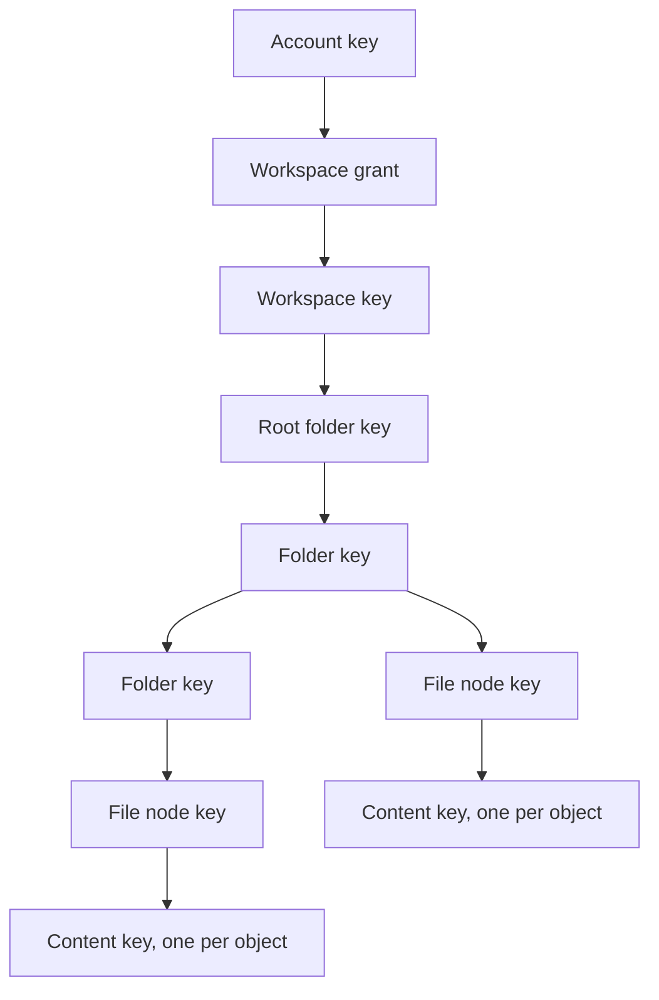

# Drive: tree, content encryption, and transfers

This document fixed the shape of HushOS Drive before code was written, the way `opaque-auth-design.md` fixed authentication, and stays the reference for what remains. It builds on what exists: independent workspace keys with per-member grants, `workspace_storage` with `used_bytes` and `reserved_bytes`, storage entitlements written by billing, and a pg-boss worker. Everything below the workspace key is new.

## Status

Content suite 2 is current, with the thumbnail sealed into the object and the plaintext size in the version envelope. Suite 1 objects from the first release are read but never written. The code lives in `packages/drive`, `packages/db/src/drive.ts` and `packages/crypto/src/drive.ts`.

### Implemented as designed

- **Tree, upload protocol and journal, download path.** Downloads stream through the app's own service worker at `/hushos-download/`, fall back to the File System Access API and then to a blob, and bundle folders and selections as store-only zips with `client-zip`.
- **Previews** for images, PDF (pdf.js over a range transport), text and media. Media plays through the same service worker, which serves a player page and answers the element's Range requests from chunks the page decrypts, rather than through Media Source Extensions, so every container the browser can play works and no codec parsing is needed.
- **Markdown and code.** Markdown renders through the data-only CommonMark path below (remark to a sanitised hast tree to React elements, raw HTML dropped, links opened only on click, images named and never fetched). Code highlights through Shiki, loaded on first use with per-grammar chunks and the JavaScript regex engine.
- **Office documents** preview on the device: Word through mammoth to HTML that is parsed to a tree and sanitised like Markdown output; spreadsheets (and CSV or TSV, decoded as UTF-8) through SheetJS to a clipped table with sheet tabs; presentations as a text outline in slide order, since nothing lays a slide out faithfully in a browser. Each renderer loads on first use, up to 32 MiB.
- **Thumbnails.** The uploader renders a 256-pixel WebP under 64 KiB for images, a PDF's first page and a video frame, encrypted under the derived thumbnail key as a one-chunk object with its own nonce, uploaded through begin, parts and complete with `purpose: thumbnail` after the content publishes. `GET /api/drive/thumbnails?versions=` hands back presigned URLs for up to 100 versions, decrypted in the worker and kept only in memory.
- **Conflicted uploads** attach as described: the same node for an epoch race, a sibling conflict copy for a version race.
- **Copy** within a workspace: for files by the server, for folders by the client walking the tree. A file's earlier version can be listed, downloaded, restored and discarded early. Each live version pays for the thumbnail it references as well as its object, so a copy that shares both is charged for both and refunded for both.
- **The client header.** Every Drive request carries `HushOS-Client: name/version`; `DRIVE_CLIENT_MINIMUMS` sets the floor per client name, refused with 426.
- **Contact pins**, ahead of sharing. A person looks another up by email, sees the fingerprint of the identity encryption key the server served, and pins it into a settings document sealed under a key derived from their own identity private key, so a root rotation or recovery never rewraps it. A later lookup that returns a different key is shown as a warning to accept, never applied.
- **Operators**: a `role` on the account, granted from the command line only, with a management overview that lists the audit's missing objects.
- **Shares to accounts**: `drive_shares` rows with the node key sealed between identity keys; authorization moved into the walk on every node-addressed route (member, else the nearest live share's role, else 404; too low a role is 403); a grantee's listing cut at the share root; editors' uploads and epochs drawn in the owner's workspace; a move refused unless both ends lie in the same share; revocation live; and the recipient opening the envelope only with a pinned granter key (pinned on first use, refused when it later differs).
- **Links**: `drive_links` rows keyed by the hash of a path token the server mints and shows once; the node key sealed under BLAKE2b(secret || argon2id(password, salt)) with the link's context; viewer-only; expiry capped at a year; revocation; a use count; visitor routes under `/api/drive/links/:token/*` that require no session, are bounded per address and per token, and authorize exactly the subtree beneath the linked node. The page at `/s/<token>#<secret>` opens the key in the worker under no account. A signed-in visitor or a share's grantee can save a copy into their own Drive, which re-encrypts each file under their own keys rather than carrying the sharer's.
- **Link ids and tokens are client-generated**, because the id is sealed into the envelope's context and the secret and token are also sealed under the node key (`secret_envelope`, opaque to the server) for the owner. That is what lets a link be shown again, re-sealed with a different password, or given a new expiry without changing the URL.
- **Rotation on revoke**, with `drive_rotations`, the parent-first work query, `prev_key_envelope` (with a `prev_key_epoch` beside it, since the previous envelope's context binds the previous epoch), re-sealed shares carrying `prev_share_envelope` until the finish, links re-sealed from the password key the owner's sealed copy now keeps (a password link from before that cannot be re-sealed and is stopped), and moves out of the subtree refused while it runs. The client drives it from the owner's device after every revocation and resumes an unfinished one on the next open.
- **Change feeds**: `GET /api/drive/workspaces/:id/changes` as a range over `change_seq` with tombstones; `GET /api/drive/shares/:id/changes` filtered by the walk and merged with `drive_share_events` written by moves across a share boundary, 410 on revocation. The web app polls both while visible and refetches only the folders a change touched, in place of a sync engine's cursor.
- **The queued-upload journal.** The upload journal keeps a row per queued file from the moment it is queued, so a reload forgets nothing that was waiting. A copy of something shared (which has no file on disk) stashes its decrypted bytes in the origin private file system under a name the journal records: a restored copy continues on its own, and one whose stash is gone is reported lost with the reservation released, never offered a file picker.

### Where the implementation differs from the design below

- **Purge fan-out.** A person's request purges the one node and the worker's `drive.purge` sweep fans out to descendants one level per pass, rather than a per-request `drive.purge-subtree` job, so the web app sends no jobs. Empty trash purges roots in batches of 100 per request, with the client calling until none remain.
- **Report key escrow** goes to the operators' own identity keys (a sealed box per current operator, 112 bytes) rather than to a separate moderation key, so there is no key to generate or keep offline and an operator opens a report under the identity they already hold. The report snapshots the reported subtree (up to 2,000 live nodes) so it outlives the owner's deletions; the deletion outbox skips objects an open or held report names; an operator's removal trashes the node beyond the owner's restore and revokes its shares and links; suspension ends the uploader's sessions; and the worker copies reported objects to an optional evidence bucket and deletes those copies after a dismissal without a hold.

### Worker jobs as they run

| Job                    | Schedule and behaviour                                                                                                                                                         |
| ---------------------- | ------------------------------------------------------------------------------------------------------------------------------------------------------------------------------ |
| `drive.expire-uploads` | As designed                                                                                                                                                                    |
| `drive.delete-objects` | As designed                                                                                                                                                                    |
| `drive.replicate`      | As designed                                                                                                                                                                    |
| `drive.purge`          | Trash and superseded versions past 30 days, tombstones past 90                                                                                                                 |
| `drive.audit-usage`    | As designed                                                                                                                                                                    |
| `drive.audit-objects`  | Nightly, least recently confirmed first; `drive.audit-replica` weekly when a replica is configured. A primary copy the replica still holds is copied back rather than reported |
| `drive.orphan-sweep`   | A bounded page of the bucket nightly, continuing from a stored cursor; paused by `DRIVE_ORPHAN_SWEEP_PAUSED_UNTIL` after a restore                                             |
| `drive.tier`           | A no-op unless `STORAGE_COLD_CLASS` names the provider's class; a read warms an object back on the next nightly pass, not on the request                                       |

### Goals for the first release

- Upload, download, rename, move, copy, trash and restore of files and folders inside a personal workspace, with content and names unreadable to the operator.
- Quota enforced before bytes move.
- Transfers that survive a closed tab.
- Previews of images, PDFs, text and media, because they are client work on top of ranged reads.

Sharing is designed here and built second. Version history, search, and desktop, mobile, file-system and command-line clients come after; the design leaves room for each and says where.

## Key hierarchy



Every node in the tree, folder or file, has its own random 32-byte **node key**, wrapped under its parent's node key. The root folder's key is wrapped under the workspace key.

A file's node key encrypts its metadata and wraps the **content key** of each of its versions. The content key encrypts the bytes of one stored **object**, and several versions may point at one object when a file is copied.

Nothing below the workspace key is derived from anything else, so:

- moving a node rewraps one key, and no descendant or ciphertext is touched;
- rotating an account root rewraps one grant per workspace, as today;
- sharing a folder is granting its node key, sealed to the recipient, and the sharing section says exactly what revoking it costs and what it cannot undo.

The client generates every node id, version id, object id and key. The server never sees a key, a name, or a plaintext byte.

## Envelopes and contexts

All envelopes use envelope suite 1 from the authentication design: XChaCha20-Poly1305-IETF from libsodium with a random 24-byte nonce and JSON associated data. UUIDs are lowercase. `epoch` and `version` are positive integers.

```text
nodeKeyEnvelope
  key   = parent node key (root: the workspace key)
  nonce = random(24)
  aad   = ["hushos/drive/node-key", 1, workspaceId, nodeId, parentId, parentKeyEpoch, keyEpoch]
  body  = XChaCha20-Poly1305(nodeKey, key, nonce, aad)        // 48 bytes

metadataEnvelope
  key   = node key
  nonce = random(24)
  aad   = ["hushos/drive/node-meta", 1, workspaceId, nodeId, metadataVersion]
  body  = XChaCha20-Poly1305(UTF8(JSON metadata), nodeKey, nonce, aad)

versionEnvelope (content suite 2)
  key   = node key
  nonce = random(24)
  aad   = ["hushos/drive/content-key", 2, workspaceId, nodeId, versionId, objectId]
  body  = XChaCha20-Poly1305(contentKey || u64be(plaintextSize) || u32be(thumbnailBytes),
                             nodeKey, nonce, aad)                       // 60 bytes; 84 with the nonce

contentKeyEnvelope (content suite 1, read but no longer written)
  aad   = ["hushos/drive/content-key", 1, workspaceId, nodeId, versionId, objectId]
  body  = XChaCha20-Poly1305(contentKey, nodeKey, nonce, aad)          // 48 bytes; 72 with the nonce

thumbnailKey = crypto_kdf_derive_from_key(32, 1, "hushthmb", contentKey)   // libsodium KDF, never the content key itself
```

### What the version envelope carries

The version envelope is the one sealed record a version has. It carries everything a reader needs that the server must not hold: the content key, the plaintext size, and the length of the thumbnail that sits at the end of the object, zero when there is none. It names the object it is for, so the server cannot point a version at any other object encrypted under the same key.

The plaintext size and the thumbnail length live here rather than on the object row because the server could derive from them what it must not learn. With the plaintext size in the clear, the difference between it and the stored size says whether a thumbnail is present, and a thumbnail is only made for an image, a PDF or a video, so its presence is the file's kind.

The thumbnail is encrypted under a key derived from the content key for that one role. A server that reframes the object cannot hand a reader the thumbnail as the file or the file as the thumbnail: the file's key does not open it. Nothing about the thumbnail is a server-side pointer; it is bytes of the object, described only inside the envelope.

### Epochs and what the associated data binds

- The root folder's node-key envelope uses the workspace id as `parentId` and the workspace key as the wrapping key. Its own `keyEpoch` comes from the workspace's node-key counter like every node's; its `parentKeyEpoch` is the workspace key's epoch, which the account layer owns and rotates on its own schedule.
- The two counters never mix: one numbers node keys, the other the workspace key, and every row carries both numbers with those meanings.
- `parentKeyEpoch` is in the associated data because a reader chooses between a parent's current and previous key by that number, and the choice must be authenticated with the rest.
- `parentId` is bound into the key envelope because a move rewraps anyway. It is left out of the metadata envelope so that a move never re-encrypts metadata and a rename never rewraps a key.
- The server owns `created_at` and `updated_at`; the client does not put timestamps into metadata to bump them.

### Metadata

Metadata is a JSON object: `{ "name": string, "mime": string | null, "size": number | null, "modified": string | null }`.

- `size` is the plaintext size and `modified` the source file's mtime, both informational. The version envelope is what a reader trusts for the size of the bytes it decrypts.
- Names are limited to 255 UTF-8 code points and may not contain `/` or be `.` or `..`. The client enforces this because the server cannot see them.
- Two siblings may have the same name. The server has no way to prevent it, and the client shows both.

## Content encryption

Content suite 2, the current suite, encrypts a version as independent chunks rather than a libsodium secretstream. An interrupted upload resumes by re-encrypting only the missing chunks, a download can start at any chunk, and the version's thumbnail, when it has one, rides as a sealed trailer of the same object.

```text
contentKey   = random(32)
contentNonce = random(16)                       // per object, stored in the clear
chunkSize    = 8 MiB of plaintext               // fixed for suites 1 and 2
chunkCount   = ceil(plaintextSize / chunkSize)  // 1 for an empty file

chunk i, 0 <= i < chunkCount:
  nonce = contentNonce || u64be(i)              // 24 bytes
  aad   = ["hushos/drive/content", suite, workspaceId, objectId,
           i, chunkCount, plaintextSize]
  body  = XChaCha20-Poly1305(plaintextChunk_i, contentKey, nonce, aad)

thumbnail, suite 2 only, when thumbnailBytes > 0:
  nonce = contentNonce || u64be(chunkCount)     // the index after the last chunk
  aad   = ["hushos/drive/thumbnail", 2, workspaceId, objectId, thumbnailBytes]
  body  = XChaCha20-Poly1305(webp, thumbnailKey, nonce, aad)

object = chunk_0 || ... || chunk_(chunkCount-1) || thumbnail?
```

### Framing

- Every ciphertext chunk is exactly `chunkSize + 16` bytes except the last.
- The object is the concatenation of chunks in order, followed by the thumbnail's `thumbnailBytes + 16` bytes when the envelope says there is one.
- The trailer starts at `plaintextSize + 16 * chunkCount`, a number only a holder of the version envelope can compute. The server sees one object of one size.
- Content suite 1, the first release's, is the same chunk framing with `1` in the associated data, no trailer, the plaintext size on the object row and the 72-byte envelope. Objects written under it are read forever and never written again, and a copy of one keeps its suite.

### What this answers

Each defect the 2026 audit found in the old design:

- The suite and chunk size are recorded on the object row, so a reader never guesses the framing.
- The associated data names the object, not the version, so a copy can share the object. The content-key envelope still binds the key to one node and version, so a version cannot be pointed at ciphertext encrypted under a different key without failing to open.
- `chunkCount` and `plaintextSize` are in every chunk's associated data, so a truncated or padded object fails authentication rather than decrypting to a shorter file, and the last chunk is identified by index rather than by a trailing marker the transport could drop.
- Chunk boundaries are fixed by arithmetic, so the reader slices the byte stream itself and does not care how the network framed it.
- Part boundaries for multipart upload are the same arithmetic: one part per chunk. 8 MiB clears S3's 5 MiB minimum part size, and its 10,000-part ceiling allows objects just under 80 GiB, above the release limit below.

### Where it runs and what the server learns

Encryption and decryption run in the existing crypto worker, which already holds libsodium and the unlocked keys. The main thread streams bytes to it and never sees keys.

An object's ciphertext size is `plaintextSize + 16 * chunkCount`, plus `thumbnailBytes + 16` when there is a thumbnail. The client declares this number, the store confirms it, and it is what quota counts.

It is also the one thing the server learns about the size of a file. With the chunk count, it bounds the plaintext to within a chunk. It cannot tell a trailer from content unless the last chunk is within a trailer's length of full, in which case the last part is longer than a chunk can be. That is the residual of this design, and it is a fraction of a percent of files.

## Data model

Six new tables. Byte counts are `bigint`; binary is `bytea` with length checks like the auth tables. The tree is an adjacency list: `parent_id` is the only structural fact, and there is no materialized path, because a path makes every move cost the size of the subtree while the reads that matter, one folder at a time, never need it.

```text
drive_nodes
  id                uuid PK           client-generated
  workspace_id      uuid FK workspaces, cascade
  parent_id         uuid FK drive_nodes, null only for the root
  kind              'folder' | 'file'
  key_epoch         integer >= 1     epoch of this node's own key, drawn from the workspace counter
  parent_key_epoch  integer >= 1     epoch of the parent key the envelope is wrapped under
  key_envelope      bytea             24-byte nonce || 48-byte body
  prev_key_envelope bytea null        during a rotation: the same key under the previous parent key
  prev_parent_key_epoch integer null  the epoch that previous envelope is wrapped under
  metadata_version  integer >= 1
  metadata_envelope bytea             24-byte nonce || body
  current_version_id uuid FK file_versions, files only
  created_by        uuid FK users     who made it; the owner unless an editor of a share did
  trashed_at        timestamptz null
  height_bound      integer >= 0      upper bound on levels below this node
  change_seq        bigint null       per-workspace sequence; null until the node is visible
  purged_at         timestamptz null  tombstone: row kept 90 days after purge
  created_at, updated_at timestamptz

  unique (workspace_id) where parent_id is null       -- exactly one root
  unique (id, workspace_id)                            -- lets parent FK include workspace
  FK (parent_id, workspace_id) -> drive_nodes (id, workspace_id)
  FK parent_id does not cascade; tombstones are removed leaves first
  index on (parent_id) where trashed_at is null
  index on (workspace_id, change_seq) where change_seq is not null
  index on (workspace_id, trashed_at) where trashed_at is not null
  index on (workspace_id, purged_at) where purged_at is not null

drive_objects
  id              uuid PK           client-generated
  workspace_id    uuid
  object_key      text              "ws/{workspaceId}/{objectId}"
  content_suite   smallint = 1
  chunk_size      integer
  chunk_count     integer >= 1
  content_nonce   bytea(16)
  plaintext_size  bigint null       suite 1 only, from the client; null for suite 2, where the envelope holds it
  ciphertext_size bigint >= 0       declared by the client at begin, verified against the object on commit
  status          'pending' | 'ready' | 'missing'
  storage_class   'standard' | 'cold'
  replicated_at   timestamptz null  set by drive.replicate; gates primary deletion
  last_read_at    timestamptz null  set when a download URL is issued, at most hourly
  created_at, ready_at timestamptz

file_versions
  id              uuid PK           client-generated
  node_id         uuid FK drive_nodes, cascade
  workspace_id    uuid
  object_id       uuid FK drive_objects
  content_key_envelope bytea        24 || 60 for suite 2, 24 || 48 for suite 1; the suite is the object's
  status          'pending' | 'ready' | 'purged'
  created_at, ready_at, superseded_at, purged_at timestamptz

  index on (object_id)

drive_uploads
  id              uuid PK
  version_id      uuid FK file_versions
  object_id       uuid FK drive_objects   the object this upload fills
  key_epoch       integer           the node key epoch the content-key envelope was wrapped under
  workspace_id    uuid
  multipart_id    text              the store's upload id
  reserved_bytes  bigint            what was added to reserved_bytes
  expires_at      timestamptz
  status          'open' | 'completing' | 'conflicted' | 'completed' | 'aborted'
  completing_at   timestamptz null
  created_at timestamptz

drive_object_deletions            the outbox every object deletion goes through
  object_id       uuid PK
  workspace_id    uuid              not a FK: the row outlives the workspace
  object_key      text
  published       boolean           false for an object that never became ready
  replicated      boolean           true once the replica holds it; drive.replicate updates this row too
  primary_deleted_at timestamptz null
  delete_replica_after timestamptz null   primary deletion + 30 days; null when never published
  done_at         timestamptz null

drive_shares
  id              uuid PK           client-generated
  workspace_id    uuid              the workspace the node lives in
  node_id         uuid FK drive_nodes
  grantee_user_id uuid FK users null   null for a link
  role            'viewer' | 'editor'
  key_epoch       integer           the node key epoch this envelope wraps
  key_envelope    bytea             24 || 48
  prev_key_epoch  integer null      during a rotation: the epoch the grantee still needs
  prev_key_envelope bytea null      the same node key at that epoch, cleared when the rotation finishes
  link_token_hash bytea(32) null    links only
  link_salt       bytea(16) null    links with a password only
  expires_at      timestamptz null
  created_by      uuid FK users
  created_at, revoked_at timestamptz

  unique (node_id, grantee_user_id) where revoked_at is null and grantee_user_id is not null
  index on (grantee_user_id) where revoked_at is null
  unique (link_token_hash) where link_token_hash is not null

drive_share_events                membership changes the ancestry filter cannot show
  share_id        uuid FK drive_shares
  change_seq      bigint
  node_id         uuid
  kind            'entered' | 'left'
  primary key (share_id, change_seq)

drive_rotations                   a subtree key rotation in progress; at most one per workspace
  node_id         uuid PK           the root of the rotation
  workspace_id    uuid              unique while finished_at is null
  target_epoch    integer           drawn from the workspace's epoch counter
  started_at, finished_at timestamptz
```

### How the rows relate

- The tree lives only in Postgres; object keys are flat. Files and folders share `drive_nodes`.
- A version is a node's pointer to an object plus the wrap of that object's content key under the node's key. An object is the stored ciphertext and its framing, and lives until no version points at it.
- A workspace gets its root row when Drive is first opened, created in the same request that stores the root key envelope. Existing accounts get it lazily, new accounts at registration once the client generates it.
- A purged node keeps its row as a tombstone, envelopes cleared, for 90 days so that a client that was offline learns of the deletion.

### Two counters on the workspace

`workspaces` gains `change_seq bigint`, incremented by every change to any node in it; the changed node takes the new value. It also gains `key_epoch_seq`, the counter every node key epoch in the workspace is drawn from, so that a rotation's target epoch is greater than every epoch any node in the workspace has ever had, whatever earlier rotations did to some subfolder.

Every write to the tree begins by locking the workspace row to take the next value, which serialises writes within a workspace. That is deliberate: it is what makes the cycle check below sound, and each write touches a handful of rows, so the lock is held for milliseconds. A listing can be cached against it, and the change feed below is a range query on it.

## Tree operations

Every operation costs a fixed number of rows, whatever the size of the tree. Anything that is naturally the size of a subtree is recorded on one row synchronously and fanned out in batches: purge and empty-trash by the worker, key rotation by the owner's client. This is the rule the API is built around: a request whose cost depends on how much data a person has is the request that takes the service down at the worst moment, and the client cannot see that cost coming.

### Effective state and the ancestor walk

A node's **effective state** comes from its ancestors. The **ancestor walk** is one recursive query from a node up to the root, capped at 128 rows, that returns the chain for breadcrumbs, the depth, and whether any ancestor is trashed or purged. Every node-addressed request runs it once.

Depth is capped at 64 for creates and for moves alike, using the height bound below, so no node ever sits deeper than 64. The walk's own cap of 128 is a defence against corruption rather than a limit anyone can reach; no filesystem a client mounts allows paths anywhere near that deep.

### The height bound

Each node carries `height_bound`, an upper bound on the number of levels beneath it.

- A create raises the bound on each ancestor in the walk that is lower than its distance to the new node, which is at most 64 rows and usually one. A move does the same along the destination's chain.
- Nothing lowers a bound synchronously, so after a move-out or a purge it can overstate, which can only refuse a move that would have been legal.
- A refused move recomputes the moved subtree's exact height once, outside the lock, and notes the workspace's `change_seq` at the time of the scan. The retry takes the lock and uses the exact height only if `change_seq` has not moved since, because a grandchild created in between would make the scan a lie; otherwise it refuses again and the client starts over.
- That scan is the one read whose cost is the size of a subtree, taken only on that path.

### Listing

Listing returns a folder's live children with their envelopes, plus the chain of ancestors from the walk. A file whose first upload has not completed has no `change_seq` and is not a child yet: it appears in nobody's listing and in no change feed until its version is ready, which is what lets an abort delete it without a trace. The client unwraps root to current folder, then children in parallel, and caches unwrapped node keys per session in the worker.

### Create

Create folder or file inserts the node with its key and metadata envelopes. A file is created with its first version in `pending` state as part of the upload flow below.

### Rename

Rename replaces the metadata envelope with `metadata_version + 1` and states the `key_epoch` the new envelope was encrypted under; the server refuses a stale version or a stale epoch with 409. The epoch matters because a rotation re-encrypts metadata without renaming, so a rename prepared under the old key and sent after would otherwise commit an envelope nobody can open. Nothing else changes.

### Preconditions on every write

Every write carries the state the client last saw:

| Write  | Precondition                                      |
| ------ | ------------------------------------------------- |
| Rename | `metadata_version` and `key_epoch`                |
| Move   | the destination and the destination's `key_epoch` |
| Upload | `current_version_id` and `key_epoch`              |

Every envelope a client sends names the epoch of the key it used, and the server refuses it if that key has been rotated away; that one rule is what keeps every stored envelope openable. A mismatch is a 409 with the current row, never a silent overwrite. A sync client that loses this race creates a conflict copy, a sibling named by the client, rather than retrying on top of someone else's change.

### Move

Move takes `{ nodeId, parentId, parentKeyEpoch, keyEnvelope }`, where the envelope is the same node key rewrapped under the destination's key at that epoch, with the new `parentId` and `parentKeyEpoch` in its context. In one transaction, under the workspace lock, the server:

1. walks the node's ancestors and refuses if the node is the root or effectively trashed;
2. walks the destination's ancestors and refuses if the destination is in another workspace, effectively trashed, or if the moved node appears in the chain, which is the cycle check; refuses if the destination's depth plus one plus the node's `height_bound` exceeds 64; refuses, too, if the node's chain contains the root of a running rotation and the destination's does not, or if the node itself still carries a previous envelope from that rotation, as the sharing section explains;
3. refuses if `parentKeyEpoch` is not the destination's current `key_epoch`, then updates `parent_id`, `parent_key_epoch` and the envelope on the node and assigns it the workspace's next `change_seq`.

Cost is one small AEAD on the client and, on the server, two bounded walks and one row update, whatever the size of the subtree. Descendants are untouched: their parent ids and envelopes are still correct, and a sync client learns of the move from the one changed row.

The height check is what keeps depth a hard ceiling. Without it, three 63-deep chains and two moves would put leaves at 189, past anything the walk reads, and those nodes could not even be moved back out.

### Copy within a workspace

Copy moves no bytes. The client creates a new node with a fresh node key and reseals the _same_ version record (key, size, thumbnail length) under it, in the source object's suite. The server, in one transaction:

- checks the allowance exactly as upload begin does and refuses with 402;
- inserts a version row pointing at the _same_ object;
- adds the object's size to `used_bytes`;
- assigns `change_seq`.

No reservation is needed because nothing happens between the check and the write. The store is never touched: the ciphertext is opaque, the associated data names the object and not the version, and the content-key envelope is what ties the key to its new node.

A copy costs quota like any other file even though the bytes are stored once, so purging either copy gives the bytes back predictably and nobody has to explain reference counting on a billing page. Copying a folder is the client copying node by node with progress, since each node needs a rewrap the server cannot do; the cost is visible and the client's. A copy into a share, later, must re-encrypt into a new object, because sharing is the operation that widens who can read the key, and copy must not do that silently.

### Trash and restore

**Trash** sets `trashed_at = now()` on the one node and assigns `change_seq`. Descendants are untouched and are effectively trashed because the walk finds a trashed ancestor. Listings exclude children with their own `trashed_at`, and a listing of a folder inside a trashed subtree is refused, so nothing under a trashed folder is reachable.

The trash view lists every node with `trashed_at` set, from the partial index. A folder trashed on its own before its parent was trashed shows as its own entry, which is what happened.

**Restore** clears `trashed_at` on the node. If the walk finds the parent effectively trashed, the server refuses with 409 `parent-trashed`, and the client offers to restore to the root, which is a move with a rewrapped key envelope and a restore in one request. The server cannot reparent on its own because a new parent means a new envelope only the client can make.

### Purge

**Purge** marks the one node `purged_at`, clears its envelopes, marks its versions purged and releases each one's bytes from the counter that holds them:

- a `ready` version's from `used_bytes`;
- a `pending` version's from `reserved_bytes`, by aborting its upload the way abort does;
- a `completing` version's not at all, because its completion takes the same workspace lock, will find the node purged at its final step, and aborts itself.

Then it assigns `change_seq` and enqueues `drive.purge-subtree`, which walks the descendants in batches of 1,000 doing the same to each. Between the request and the end of the fan-out the descendants are unreachable through the purged ancestor, so the tree is consistent throughout. The worker also purges anything trashed for more than 30 days.

A person does not have to wait. **Delete forever** on a trashed item is this same request, and **Empty trash** enqueues `drive.empty-trash`, which purges the workspace's trash roots in batches of 100, because a trash can hold a hundred thousand roots and one request must not. Trashed bytes count against quota until purged, and the UI says so and shows the trash draining; this keeps accounting honest and gives people the same control an operating system does.

### Releasing objects and tombstones

- A version's bytes are released when it is purged.
- An object's row is replaced by a `drive_object_deletions` row when its last version is purged, in the same transaction, and the worker takes it from there. A published object's primary copy waits for the replica, as the backups section says, and the row records whether the object was ever published so that one that never was does not wait for a copy nobody scheduled.
- Tombstones, purged nodes with their envelopes cleared, stay 90 days for the change feed and are then deleted leaves first in batches, which the non-cascading parent FK enforces: a mistake fails loudly rather than deleting live rows.

### Versions

Versions are created by every upload to an existing file, each with its own object, and a file keeps at most one besides the current: the one it displaced.

- When a new version completes, the current version becomes superseded and the version that was superseded before it is purged in the same transaction, bytes released.
- The superseded version is kept 30 days and counts against quota. `DELETE /api/drive/versions/:id` discards it early, which is what freeing space means for versions.
- Restoring it is one statement: current and superseded swap, `superseded_at` cleared on the restored one and set on the displaced one.
- The purge job never touches a current version, whatever its timestamps say.
- A full history, and encrypted patches so that a small edit to a large file does not re-upload it, are later content suites and do not change this table.

## Upload protocol

Quota is reserved before any byte is accepted, confirmed against the real object on completion, and released on abort or expiry.

### 1. Begin

`POST /api/drive/uploads` with the node (new or existing), its envelopes, the object's `contentSuite`, `chunkCount`, `ciphertextSize`, `contentNonce`, and the version envelope. The client knows the ciphertext size exactly before it begins, because the thumbnail is rendered first and sealed into the envelope with the size; nothing about the object changes after begin.

What the server refuses:

- a suite it does not accept, with 400;
- a `ciphertextSize` that no object of `chunkCount` chunks can have: every part but the last is `chunkSize + 16`, and the last must be between 16 bytes (an empty file) and a full chunk plus a full trailer, `chunkSize + 16 + 65536 + 16`;
- a file over the per-file limit, enforced on what the server can see, `ciphertextSize - 16 * chunkCount`, allowing for a trailer.

In one transaction it:

1. checks `base + live entitlements - used - reserved >= ciphertextSize`, and refuses with 402 if not;
2. adds `ciphertextSize` to `reserved_bytes`;
3. inserts the node if new with no `change_seq`, the object and the version as `pending`, and the upload row naming the object and the node's current `key_epoch`, with a 24-hour expiry.

It then starts a multipart upload at the store and returns the upload id and presigned PUT URLs for the first batch of parts. Each URL is signed for one part number in `1..chunkCount` with `Content-Length` as a signed header, set to the exact length of that part, which the server derives from `ciphertextSize` and `chunkCount`. A PUT with any other length fails the signature at the store, so the reservation bounds what the store accepts and not only what the database admits. A store that ignores signed headers is caught at complete by the size check, with the 3-day lifecycle rule bounding what abandoned parts can cost.

### 2. Parts

- The client encrypts chunk `i` in the worker and PUTs it to part `i + 1`, up to four in flight.
- A failed part is retried with exponential backoff and full jitter, starting at one second and capped at a minute, and a `Retry-After` header from the store or the API is honoured. Without the jitter, every client that lost the same store for a moment retries in the same instant and loses it again.
- The store returns an ETag per part; the client records it.
- `GET /api/drive/uploads/:id/parts?from=` returns more presigned URLs. URLs expire after an hour and can always be reissued.

### 3. Resume

The client keeps an upload journal in IndexedDB:

- the upload id and version id;
- the file handle, where the browser allows it;
- the source's size and modification time;
- the ETags received;
- the sealed thumbnail trailer as the worker produced it at begin;
- a BLAKE2b hash of every plaintext chunk it has encrypted.

The trailer is journaled as ciphertext, never as the image: a resumed last part appends the same bytes, so a thumbnail is encrypted once under its nonce however many times the part is sent, and a journal without the trailer the envelope promises is uncertain like any other.

The hash is written in a journal transaction with `durability: 'strict'` and awaited before that chunk's PUT starts, and hash and ciphertext come from the same buffer, so the journal never lacks a record for a chunk that may have left the machine. A journal that is missing, unreadable, or written by a browser that does not honour the durability hint is uncertain, and an uncertain journal never resumes: the upload starts over with fresh material. Resuming is an optimisation; the nonce rule is not.

After a reload the client re-reads the source and checks it against the journal: size and modification time first, then the hash of every chunk already encrypted.

- If all match, it asks the server which parts the store has, re-encrypts only the missing chunks, and continues. Encryption is deterministic given the key and nonce, so re-encrypted parts are byte-identical.
- If anything differs, or the source cannot be re-read, the client aborts the upload and starts a new one with a fresh object, key and nonce.

This rule is not about correctness of the file, though a mix of old and new chunks would authenticate chunk by chunk and assemble into a file nobody wrote. It is that encrypting different bytes under a key and nonce that already produced a ciphertext, which left the machine as an uploaded part, is the one thing XChaCha20-Poly1305 forbids.

### 4. Complete

`POST /api/drive/uploads/:id/complete` with the part list, in three steps that arbitrate against abort, expiry, purge and each other:

1. In a short transaction, the upload moves from `open` to `completing` and records the time. An upload in any other state is refused, and the version precondition is checked here to fail early.
2. The server completes the multipart upload at the store and reads the object's size. If it differs from `ciphertextSize` the object is deleted and the upload aborted as below.
3. Under the workspace lock, the server rechecks everything the upload assumed: the node and its ancestors are not purged, the node's `key_epoch` is the one the upload recorded, for a new file the node's `parent_key_epoch` is the parent's current epoch, and the file's `current_version_id` is still the one the upload named.

Trash is deliberately not in that list. A file trashed while its upload was in flight completes into the trash, with the new version current, because trash is reversible and the person's bytes are not; begin refuses uploads into trashed places, and that is where the trash check lives.

Step three is the check that counts: two uploads that both started from the same version can both pass the first step and both finish at the store, but only one passes here. If it passes, in that transaction:

- `used_bytes += size`, `reserved_bytes -= size`;
- the object and the version become `ready`, and the version becomes current;
- the displaced version is superseded and the one it had superseded is purged;
- the node takes the next `change_seq`, the upload becomes `completed`, and a `drive.replicate` job is queued.

#### Conflicts and attach

If the version or epoch precondition fails, the upload becomes `conflicted`, its bytes still reserved and its object still in the store, and the client gets 409 with the winner. The client resolves that before the upload expires, either by aborting or by attaching the finished object: `POST /api/drive/uploads/:id/attach` with a destination, a fresh content-key envelope and, for a new node, a fresh node-key envelope, each with the epoch it wrapped under. Attach moves the bytes from reserved to used with no second upload, because the associated data names the object and not the node.

Attach validates what it is given against the tree as it is now, under the workspace lock:

- The destination is a new sibling node for a version race, or the same node for an epoch race.
- In both cases the envelope's epoch must equal the destination node's current `key_epoch`, and the destination's ancestors must not be purged.
- A same-node attach additionally requires the node's `current_version_id` to be the one begin recorded, because another upload may have published while this one was being rewrapped. An attach that ignored that would be the silent overwrite the whole three-step dance exists to prevent. If it has moved, attach fails into `conflicted` again and the client attaches as a sibling instead.

An attach that passes does what step three does: for a sibling, the new node is created and its first version published; for the same node, the version becomes current, the displaced one superseded, the older one purged. Bytes move from reserved to used, the node takes the next `change_seq`, and replication is queued. Either failure leaves the upload `conflicted` and the client tries again with fresher keys; expiry aborts a `conflicted` upload like any other.

#### Retries and purge

- If the node was purged meanwhile, the upload is aborted and the object deleted.
- A retry after a failure in the middle finds the store already done: `NoSuchUpload` with an object present at the right size is treated as step two having succeeded, and step three runs with the same rules.
- A repeated call for a completed upload returns the same result.

### 5. Abort

`DELETE /api/drive/uploads/:id`, or the worker's hourly `drive.expire-uploads` job for anything past `expires_at`:

- abort the multipart upload at the store;
- release `reserved_bytes`;
- delete the pending version and object and, for a new file, its node, which nobody has seen.

Both refuse an upload that is `completing`. An aborted `conflicted` upload's object goes into the deletion outbox as never published, so it is deleted at once and waits for no replica. The expiry job resolves a `completing` upload older than an hour by asking the store: an object present at the recorded size is finalised as step three above, anything else is aborted.

### Sizes and limits

- Sizes are trusted only from the store, never from the client.
- The reservation is what makes concurrent uploads honest: two uploads that would each fit alone but not together see the other's reservation.
- The per-file limit is `DRIVE_MAX_FILE_BYTES`, 32 GiB by default, reported by `capabilities` and enforced at upload begin on the declared ciphertext size less its tags, with a trailer's allowance. Raising it is an environment change, not a release.
- The server refuses a value above what 10,000 parts of 8 MiB can hold, just under 80 GiB.
- Empty files are allowed and have one 16-byte chunk.

## Download

`GET /api/drive/versions/:id/url` returns a presigned GET URL valid for an hour, or 15 minutes for a node reached through a share, reissued on demand. Before issuing it the server checks the session, that the version and its object are `ready`, and that the walk grants the caller at least viewer access to the node.

The client fetches with `Range` headers in chunk-aligned windows, decrypts each chunk in the worker as it arrives, and streams to disk without holding the file in memory:

1. through the File System Access API where the browser offers it;
2. otherwise through a service worker that turns the decrypting stream into a download response, the technique StreamSaver made common;
3. a blob as the last resort, for files under 256 MiB in a browser with neither.

Range and streaming are one mechanism: any chunk can be fetched and decrypted on its own, and previews, seeking in media and file-system hydration all use it. Downloads are never blocked by quota: being over the allowance stops uploads and nothing else, which is what the pricing page and the terms promise.

Presigned URLs mean the person's browser talks to the object store directly, so the store sees their IP address and the bucket hostname appears in their network log. That is the normal trade for not proxying terabytes through the app server. Proxying stays possible later behind the same API without changing the client protocol.

## Previews and thumbnails

The server cannot render anything. It holds ciphertext and does not know a PDF from a photograph, because the type is inside the metadata envelope. Every preview is the client decrypting bytes it fetched by range and rendering them itself, which is also what keeps a preview from becoming a second copy of the plaintext somewhere.

### Thumbnails

Thumbnails are made by the uploader. For an image, a PDF's first page, or a frame of a video, the client renders a 256-pixel WebP of at most 64 KiB before the upload begins, and the worker seals it as the trailer of the object, encrypted under `thumbnailKey`, which the envelopes section derives from the version's content key for this role alone, with the trailer's length in the associated data and in the version envelope.

The thumbnail is then bytes of the object like any other:

- it goes up in the last part, and is covered by the reservation, the signed part length, the size check at complete, the replica and quota;
- it lives and dies with its version;
- there is no thumbnail upload, no thumbnail object, no pointer, and no state the server keeps about it;
- a file whose render fails or whose type has none simply has a trailer length of zero in its envelope;
- a copy shares the object and therefore the thumbnail.

What keeps the trailer apart from the content is the key: the file's key does not open it, and the trailer's associated data is its own, so a server that reframes the object produces something the client refuses to open rather than a thumbnail decrypting as the file.

The server cannot tell which versions have thumbnails, so `GET /api/drive/thumbnails?versions=` simply returns presigned URLs for the objects of up to 100 ready versions at once, and the client asks only for versions whose envelope, opened when the folder was listed, says there is a trailer. The worker fetches the trailer's byte range from the same URL a download would use, decrypts it, and the page keeps decoded thumbnails in memory for the session, never on disk. A thumbnail fetch does not bump `last_read_at`; opening the file does.

Files uploaded under suite 1 had their thumbnails in separate objects. Those objects were retired with the move to suite 2, and such a file shows its type's icon until it is uploaded again.

### Viewers

Viewers in the first release, each a client renderer fed by ranged, decrypted reads:

- **Images** decrypt to a blob URL that is revoked when the viewer closes. SVG is shown through an `img` element and never inlined, because SVG carries script.
- **PDF** uses pdf.js in its own worker with a range transport: pdf.js asks for byte ranges, the client fetches and decrypts the chunks that cover them, and the first page shows before the file has finished downloading. Text selection and find work; saving annotations does not.
- **Text, Markdown and code** up to 8 MiB decrypt into the page. Markdown is rendered as data, never as code: a CommonMark parser produces a syntax tree with raw HTML disabled, the tree is rendered through an allowlist of elements and attributes, links carry `rel="noopener noreferrer"` and open only after a click on the actual link, and image references are not fetched, since the page's policy blocks remote loads anyway. The legal pages are not a model here: they compile trusted MDX into React at build time, which is exactly what must never happen to an uploaded file inside an unlocked session. Code is highlighted client-side from the same data-only path.
- **Audio and video** seek through range. Fragmented MP4 and WebM play through Media Source Extensions, decrypted chunk by chunk as the player asks; other containers play from a blob under 256 MiB and offer download above it. There is no transcoding, because that needs plaintext on a server.
- **Office documents** have no preview in the first release. A client-side renderer can come later; a server-side converter never can.

Anything else shows its card, size and type, and a download button.

What every preview holds to:

- decrypted bytes exist in memory and in blob URLs only, never in IndexedDB or the cache;
- renderers run in workers where they exist;
- the page's content security policy stops a preview from loading anything remote;
- a preview never sends bytes anywhere.

## Quota

```text
allowance = base_quota_bytes + sum(live storage_entitlements)
used      = used_bytes                 // every unpurged version's object size, copies included
free      = allowance - used - reserved_bytes
```

- An upload begins only if `free >= ciphertextSize`.
- After a plan ends, `allowance` drops and `free` goes negative; uploads refuse, reads work, trash and purge work and reduce `used`.
- The worker's daily reconcile already keeps entitlements right. A second job, `drive.audit-usage`, recomputes `used_bytes` as the sum, over ready versions (a pending one's bytes are its upload's reservation), of each version's object size, for a sample of workspaces each night and logs any drift, so an accounting bug is noticed rather than trusted.

## Sharing

Sharing is built after the first release, but the tree, the keys and the walk are shaped for it now so that nothing is rebuilt. There are two kinds: a share to another HushOS account, and a link for anyone.

### A share is one node's key

A share is one node's key, sealed to one grantee, with a role. The grantee unwraps the node key and descends the subtree exactly as the owner does, because every descendant's key is wrapped under its parent's. A share is one row and one envelope whatever the size of the subtree, and the workspace key is never involved.

Share envelopes come in two suites, told apart by length. Suite 2 is hybrid: the X25519 agreement of suite 1 and an ML-KEM-768 (FIPS 203) encapsulation to the grantee's post-quantum identity key, combined so the envelope opens only for someone holding both private halves and stays shut unless both problems fall. Suite 1 is still read, for shares made before the grantee had a KEM key, and still written for a grantee who has none yet; it is never chosen when the grantee's KEM key is known, and a suite 1 share is re-sealed as suite 2 by the owner's device once the grantee's key appears (see re-sealing below).

```text
shareEnvelope, suite 1 (72 bytes; X25519 alone)
  key   = crypto_box_beforenm(granteePk, granterSk)   // X25519 identity keys, libsodium
  nonce = random(24)
  aad   = ["hushos/drive/share", 1, workspaceId, nodeId, keyEpoch, granteeUserId, granterUserId]
  body  = XChaCha20-Poly1305(nodeKey, key, nonce, aad)   // 48 bytes
  envelope = nonce || body

shareEnvelope, suite 2 (1160 bytes; hybrid X25519 + ML-KEM-768)
  pair    = crypto_box_beforenm(granteePk, granterSk)
  ct, ss  = ML-KEM-768.Encaps(granteeKemPk)             // ct 1088 bytes, ss 32 bytes; noble
  key     = HKDF-SHA-256(ikm = pair || ss, salt = ct, info = "hushos/drive/share-key/v2")
  nonce   = random(24)
  aad     = ["hushos/drive/share", 2, workspaceId, nodeId, keyEpoch, granteeUserId, granterUserId]
  body    = XChaCha20-Poly1305(nodeKey, key, nonce, aad)   // 48 bytes
  envelope = nonce || ct || body

linkEnvelope (to anyone with the link)
  linkSecret  = random(32), carried in the URL fragment, never sent to the server
  passwordKey = argon2id(password, link_salt) with the account layer's password profile, or 32 zero bytes without a password
  key   = crypto_generichash(linkSecret || passwordKey)
  nonce = random(24)
  aad   = ["hushos/drive/link", 1, workspaceId, nodeId, keyEpoch, shareId]
  body  = XChaCha20-Poly1305(nodeKey, key, nonce, aad)
```

### Pinned identity keys

The granter seals to the grantee's identity keys, which the server serves, and the grantee derives the same key from the granter's public key. Because the server serves those keys, a dishonest server could substitute its own and read the share.

- The client pins a contact's key on first use and shows both people a fingerprint to compare. A changed key is a warning that must be accepted, never a silent update.
- Pins live in the person's encrypted settings on the server, sealed under a key derived from the identity encryption private key, which survives password changes, root rotation and recovery unchanged, so the settings never need rewrapping. Every device they unlock sees the same pins.
- A pin kept in one browser would make each new device trust-on-first-use again, which is the attack the pin exists to catch.
- The fingerprint covers the X25519 key. The ML-KEM key is vouched for by the identity's Ed25519 signing key: the identity signs `["hushos/identity/kem", 1, userId, x25519PublicKey, kemPublicKey]`, the server refuses to store a KEM key without a valid signature, and a client verifies it before using the key. A pin records the KEM key's SHA-256 the first time it is seen valid; a different KEM key served later is refused like a changed X25519 key, and a KEM key that goes missing is refused as a downgrade, so a server cannot quietly turn hybrid shares back into X25519 ones.
- Every place the server, not the person, names the grantee goes through the pin: the share dialog looks the pinned contact up and seals to the served keys only when they match the pin; a rotation re-seals each remaining share to the pinned keys and leaves a share whose served keys the pin refuses with its old envelope, which the rotation makes unopenable, rather than sealing to a key nobody vouched for; and the background pass that re-seals older shares does the same.
- Key transparency is a later layer on top of the same pin.

### Re-sealing older shares

An identity made before hybrid sharing has no KEM key. On its next unlock the device mints one (seed wrapped under the root beside the X25519 key, binding signed), stores it once through `POST /api/auth/identity/kem`, and from then on every share sealed to that person is suite 2. Shares sealed to them earlier stay suite 1 until the owner's device next opens Drive: it lists what it shares out, and for each suite 1 share whose grantee now serves a KEM key the pin accepts, re-seals the node key hybrid at the current epoch through `PUT /api/drive/shares/:id/envelope`. The repository accepts that only from the granter, only for a live share, and only at the node's current key epoch, so a rotation in flight is never raced.

### Authorization is the walk

Every node-addressed request already walks the ancestors. For a caller who is not a member of the workspace, the walk also looks for an unrevoked, unexpired share of any node in the chain granted to the caller, or matching the link token, and the nearest one sets the role. A caller with neither gets 404, the same answer as for a node that does not exist.

| Role   | May                                                                                                                                                                       |
| ------ | ------------------------------------------------------------------------------------------------------------------------------------------------------------------------- |
| Viewer | Read, list, download and follow the feed                                                                                                                                  |
| Editor | Also create, upload, rename, move and trash inside the share. A move must keep both source and destination inside the same share, since the mover holds no key outside it |
| Owner  | Alone shares, revokes, purges, restores, and moves nodes across the share boundary                                                                                        |

### Bytes belong to the owner

Everything an editor uploads lands in the owner's workspace and counts against the owner's quota. Begin checks the owner's allowance and refuses with 402 whoever is uploading, and the editor sees the owner's free space. Node rows record `created_by`, so the owner can see who added what. A copy into a share re-encrypts into a new object under a fresh content key, as the copy rule says.

### Each share has its own feed

`GET /api/drive/shares/:id/changes?since=` is the owner's workspace feed filtered to rows whose ancestor chain contains the shared node, one walk per row over a page of at most 200, merged with the share's own membership events.

The filter alone would lie at the boundary: a node moved out of the share no longer has the shared node in its chain and would vanish without a word, and a folder moved in announces only its root while its descendants keep sequence numbers below the cursor. So a move whose source and destination chains cover different shares writes a `drive_share_events` row for each affected share, `left` or `entered` with the node id, at the workspace's next `change_seq`. A client drops the subtree on `left` and lists it on `entered`, the same way it lists the shared node itself on first sync.

Revocation ends the feed with 410. A sync client mounts each share as a root of its own, and "Shared with me" is the list of the caller's live shares.

### A link is a share without a grantee

`/s/{token}#{secret}`. The path token, hashed, finds the share; the fragment never leaves the browser. `GET /api/drive/links/:token` returns the shared node with its envelopes and, for a file, a presigned URL, with no session; the browser derives the key and decrypts in the crypto worker under an ephemeral session. Links are viewer-only in the sharing release, with an optional password and expiry, and are rate-limited per token and per address, because the token is the only secret the server ever sees.

### Revocation stops the server; rotation shuts the door

Revoking a share sets `revoked_at`, and the server refuses that grantee on the next request, on every route, because the walk consults shares live. Two things revocation does not reach, and the document says so rather than implying otherwise:

- Presigned download URLs already issued stay valid until they expire. So URLs for shared content are issued for 15 minutes and reissued on demand, which a revoked grantee cannot do; a member who kept a content key and an unexpired URL can still fetch and read that one object inside that window.
- Keys a former member cached are theirs.

So the owner's client then rotates: a new node key for the shared node and every descendant, `key_epoch` bumped, each child's key envelope rewrapped, each metadata envelope and content-key envelope re-encrypted, and the share envelopes of the members who remain re-sealed under the new key. Content keys and objects are not touched: re-encrypting terabytes to shut out one person is not something a client does. The guarantee is about authorization: a revoked member gets nothing further from the API, and nothing further from the store once the last URL they held has expired.

### What a rotation must visit

Rotation is the one client-side job in Drive whose size is a subtree, and it has to survive being interrupted and being raced. A `drive_rotations` row names the root and the target epoch, which the server takes from the workspace's `key_epoch_seq`; every epoch a node has ever carried came from that same counter, so the target is above all of them.

What the rotation has to visit is not "nodes below the target" but nodes that are either below it or wrapped under a parent key that is. A node carries its own key's epoch and, separately, the epoch of the parent key its envelope is wrapped under. The rotation is finished only when every node in the subtree has both at or above the target, except the root, whose parent lies outside the rotation and never reaches the target: the root is done when its own epoch is at the target and its envelope is wrapped under its outside parent's current key, which the ordinary move precondition already states.

The distinction matters because the tree moves while a rotation runs. A node already at the target moved beneath an unrotated folder is wrapped under that folder's old key; a node created beneath an unrotated folder draws a fresh epoch above the target but is likewise wrapped under the old parent key. Judged by their own epoch both would be skipped, and clearing the parent's old key would strand them; judged by the parent-key epoch both are visited and rewrapped, keys unchanged.

### Moves while a rotation runs

- A node cannot leave the subtree while the rotation runs: a move whose source chain contains the rotation root and whose destination chain does not is refused with 409 until the rotation finishes, which the two walks a move already does decide with no extra cost. Letting a half-rotated folder leave would strand its children: the folder's new key is rewrapped under the destination, its children still hang off its old key, and the previous envelope that reached that old key is cleared when the rotation ends.
- Moves into and within the subtree stay allowed for nodes the rotation has not reached yet, since the parent-key epoch is what the rotation looks at.
- A node the rotation has already reached, one that still carries a previous envelope, cannot move at all until the rotation finishes, and its own row decides that in constant time. A move rewraps only the current key; the previous envelope would stay wrapped under the old parent's old key and bound to the old parent id, so a client that unlocked fresh and walked down through the new parent could reach the node's new key but never its old one, and the unrotated children beneath it, which still hang off that old key, would be unreadable and unfinishable. Rewrapping both keys instead would need the previous envelope wrapped under whichever of the destination's keys a reader on the old path holds, which is not a single answer, so the rule is refusal.

### One rotation at a time, in batches

One rotation runs per workspace at a time; starting a second is refused until the first finishes, which keeps the frontier a single line. The client works top-down in batches of 200 through `POST /api/drive/nodes/rotate`, each batch a set of nodes whose parents have already reached the target epoch, with the node's `change_seq` as the client read it as the precondition on every row.

Epochs alone are not enough for that check: a whole rotated subtree shares one epoch, so a node moved between two of its folders, or renamed, changes neither epoch and would have the client install an envelope bound to the old parent or the old metadata version. Every write to a node advances its `change_seq`, so a stale row is refused and the client re-reads it on the next pass.

### Previous envelopes and grants

The server keeps each rotated node's previous envelope beside the new one, in `prev_key_envelope` with `prev_parent_key_epoch`, until the rotation finishes, so a reader who holds the old parent key can descend through rotated nodes to the ones still below the frontier.

That reader must hold both keys of the root, which is the part a previous envelope alone does not give a grantee: the shared root's old envelope is wrapped under a parent outside the share, a key the grantee never had. So when a rotation starts, the owner re-seals every remaining share with both the new root key and the old one, in `key_envelope` and `prev_key_envelope`. A grantee who unlocks mid-rotation opens the previous envelope to reach unrotated children and the new one for rotated ones, and the previous grant is cleared with the previous envelopes when the rotation finishes.

The work set is a paginated server query, `GET /api/drive/nodes/rotate?root=&cursor=`, over every node in the subtree whose own or parent-key epoch is below the target, visible or not. Not the feed: a file whose first upload is still in flight has no `change_seq` and is in no feed, and a rotation that walked the feed would skip it, clear the previous envelopes, and leave the finished upload unreadable. A crashed client resumes from the same query. When it returns nothing, the rotation row is finished and the previous envelopes and grants are cleared.

### Writes that race a rotation

Writes race it in one way that matters: an upload begun under the old node key would publish a content-key envelope nobody can open. So every upload records the node's `key_epoch` at begin, complete requires it unchanged under the workspace lock, and a mismatch is the `conflicted` state above. The client fetches the new node key from the feed, rewraps the content key, and attaches; attach checks the epoch of the envelope it is handed against the node as it is now, never the epoch begin recorded. Renames, creates and moves already carry the epoch of the key they wrapped under, so an editor writing with a stale key is refused rather than accepted unreadable.

## Object storage

Any S3-compatible store works: the server uses the AWS SDK's S3 client and presigner, which already sit beside the SES client in the dependency tree. Settings:

| Variable                                                                                                                                             | Purpose                                                                                                                       |
| ---------------------------------------------------------------------------------------------------------------------------------------------------- | ----------------------------------------------------------------------------------------------------------------------------- |
| `STORAGE_ENDPOINT`                                                                                                                                   | S3 endpoint URL                                                                                                               |
| `STORAGE_REGION`                                                                                                                                     | Region name the endpoint expects                                                                                              |
| `STORAGE_BUCKET`                                                                                                                                     | One bucket per instance                                                                                                       |
| `STORAGE_ACCESS_KEY_ID`, `STORAGE_SECRET_ACCESS_KEY`                                                                                                 | Credentials scoped to that bucket                                                                                             |
| `STORAGE_FORCE_PATH_STYLE`                                                                                                                           | `true` for MinIO and most self-hosted stores                                                                                  |
| `STORAGE_REPLICA_ENDPOINT`, `STORAGE_REPLICA_REGION`, `STORAGE_REPLICA_BUCKET`, `STORAGE_REPLICA_ACCESS_KEY_ID`, `STORAGE_REPLICA_SECRET_ACCESS_KEY` | The replica bucket; all optional, and without them replication is off, the worker says so at start, and deletions do not wait |
| `DRIVE_MAX_FILE_BYTES`                                                                                                                               | Per-file limit, default 32 GiB, reported by `capabilities`                                                                    |

- The bucket needs a CORS rule allowing `PUT` and `GET` with `Range` from `APP_ORIGIN` and exposing `ETag`.
- The Compose stack gains a MinIO service with a bootstrap step that creates the bucket and the CORS rule, so `bun run selfhost:up` works unchanged.
- For the hosted service, the primary is Cloudflare R2 with the EU jurisdiction restriction, so content stays in the EU, and R2 charges nothing for egress, which is what every presigned download and every replication read is.
- The replica is Backblaze B2 in its EU region through its S3 endpoint: ingress is free and storage is the cheapest of the credible options, which is the right shape for a copy that is written once and read in an emergency.
- Both are S3-compatible, so the choice is configuration, and the replica credentials live only on the worker.

Object keys carry no information: `ws/{workspaceId}/{objectId}`. The store holds ciphertext only, and a listing of the bucket reveals workspace ids, object ids, sizes and timestamps, nothing else.

## API and packages

A new `@hushos/drive` package with the same split as auth and billing:

| Entry        | Holds                                                               |
| ------------ | ------------------------------------------------------------------- |
| `./server`   | The Elysia handlers' logic: tree, uploads, storage client           |
| `./client`   | The browser orchestration: listing cache, upload journal, streaming |
| `./api`      | The contract implemented over the shared Treaty client              |
| `./protocol` | The constants                                                       |

Content and envelope primitives go into `@hushos/crypto` under a new `drive.ts`, and the crypto session gains requests for node keys, metadata, and chunk encryption so that keys stay in the worker.

### Routes

Under `/api/drive/`:

- `capabilities`
- `workspaces/:id/root`, `workspaces/:id/changes`, `workspaces/:id/trash` (empty)
- `nodes/:id/children` (cursor-paginated), `nodes` (create), `nodes/:id/metadata`, `nodes/:id/parent`, `nodes/:id/copy`, `nodes/:id/trash`, `nodes/:id/restore`, `nodes/:id` (purge), `nodes/rotate`
- `uploads`, `uploads/:id/parts`, `uploads/:id/complete`, `uploads/:id/attach`, `uploads/:id` (abort)
- `versions/:id/url`, `versions/:id` (discard a superseded version)
- `thumbnails`
- `shares`, `shares/:id`, `shares/:id/changes`
- `links/:token`, without a session

All are session-bound and Origin-checked like billing; bodies carry envelopes as Base64url with tight length limits.

### The protocol is versioned from the first release

A native client cannot be redeployed: a File Provider extension or a CLI that someone installed keeps running for months after the server moved on.

- `GET /api/drive/capabilities` returns the protocol version, the content and envelope suites the server accepts, the chunk size, the per-file and depth limits, the name length, and the tombstone window, so no client hardcodes a number it will later be wrong about.
- Every client sends `HushOS-Client: <name>/<version>`. The server refuses versions below a configured minimum with 426 and a message that names the fix, and refuses unknown suites on upload begin.
- Policy, meaning quota, limits, validation of preconditions, and what a state transition allows, lives on the server only. A client carries cryptography and presentation, never a rule the server would have to trust it to apply.

### Worker jobs

| Job                    | Runs                                                                                                                                                                                              |
| ---------------------- | ------------------------------------------------------------------------------------------------------------------------------------------------------------------------------------------------- |
| `drive.expire-uploads` | Hourly                                                                                                                                                                                            |
| `drive.purge`          | Daily, for trash and superseded versions past 30 days and for tombstones past 90                                                                                                                  |
| `drive.purge-subtree`  | The fan-out queue a purge request pushes its node onto                                                                                                                                            |
| `drive.empty-trash`    | A workspace's trash roots in batches                                                                                                                                                              |
| `drive.replicate`      | Queued for every completed object; copies it to the replica and sets `replicated_at` on the object row, and `replicated` on its outbox row if purge got there first                               |
| `drive.delete-objects` | Drains `drive_object_deletions`, deleting the primary copy only for rows whose object is on the replica, or at once when no replica is configured, and the replica copy 30 days after the primary |
| `drive.audit-usage`    | Nightly                                                                                                                                                                                           |
| `drive.audit-objects`  | Nightly, sampling the replica weekly                                                                                                                                                              |
| `drive.tier`           | Nightly                                                                                                                                                                                           |
| `drive.orphan-sweep`   | Weekly                                                                                                                                                                                            |

Account deletion writes every object of the workspace to `drive_object_deletions` inside the transaction that removes the rows. The outbox is a table, not a queue message, so it needs nothing from the job library's transaction support, and each row carries the key, the replica state and the dates, so the sequence finishes after every other record of the object is gone. A failed transaction destroys nothing; a committed one cannot be forgotten.

## Native clients, sync, and file-system providers

Desktop apps on the operating systems' cloud-file frameworks (File Provider on macOS and iOS, Cloud Files on Windows), a FUSE mount on Linux, mobile apps and a CLI are all planned on top of the same store and API. Nothing in them needs a different storage backend: the store holds opaque ciphertext that any client fetches by presigned URL, and every byte of protocol lives in the API and the crypto suite. What they need from this design, and what it provides:

- **A change feed, not re-listing.** `GET /api/drive/workspaces/:id/changes?since=<seq>&limit=` returns nodes with `change_seq` greater than the cursor in order, envelopes included, tombstones included, and the new cursor. A node without a `change_seq`, a file whose first upload has not completed, is not in the feed and cannot leave a ghost when its upload is aborted. A sync engine keeps one cursor per workspace and never walks the tree after the first sync. A cursor older than the tombstone window forces a full listing. Trash and move are one row in the feed: the client applies them to its local copy of the subtree the way the server derives effective state from ancestors, and only purge fans out into one tombstone per descendant.
- **Placeholders and on-demand hydration.** File-system providers show files before their bytes are local and fetch content when opened. Chunk-aligned `Range` reads on the presigned URL, with the chunk index authenticated, mean a client can hydrate any 8 MiB of a file independently and cache chunks by `(versionId, index)`.
- **Whole-version writes.** A save from a desktop app is an upload of a new version, with `current_version_id` as the precondition; the framework's own conflict path handles a 409. Small edits to large files re-upload the file in the first release; content-defined chunking and per-chunk deduplication can be added as a later content suite without changing the tree.
- **Offline creation.** Node and version ids are client-generated, so a client can create folders and stage uploads offline and reconcile when back, with 409s resolved as conflict copies.
- **Stable identifiers.** Renames and moves never change a node id or a version's object key, which is what keeps a provider's local database consistent through them.
- **Portable cryptography.** Every Drive primitive is libsodium: XChaCha20-Poly1305 with JSON associated data, random keys and nonces. There is no Web Crypto in the Drive suite, so a Rust or Swift implementation is a direct transcription with test vectors from the web client. The account-layer HKDF stays where it is; a native client reaches the workspace key through the same grant.
- **Sessions for native clients.** The API today is bound to an `HttpOnly` cookie. Native clients need the same session presented as a bearer token; that is an auth-package change (a session issued to a device, sent in a header, revocable from Account settings) and a prerequisite for the first native client, not a Drive change.
- **Pagination.** Children listings and the change feed are cursor-paginated so a folder with a hundred thousand entries is usable from a mount.
- **Backoff everywhere.** Every retry, of a part, an API call, or a change-feed poll, uses exponential backoff with full jitter and honours `Retry-After`; an idle sync client polls the feed no more than every 30 seconds, jittered. A thousand mounts that all retry in lockstep after a blip are the outage that follows the blip.
- **Capabilities, not constants.** A native client reads limits and suites from `capabilities` at startup and sends its version on every request, as above.
- **Shares are extra roots.** Each live share is mounted as its own root with its own feed and cursor, and a revoked share unmounts on the 410.

FUSE and File Provider both want fast metadata and lazy content; the tree in Postgres with one round trip per folder and the change feed give the first, ranged chunk reads give the second. A CLI is the same client library without a window.

## Operations: lifecycle, tiering, and backups

The store is the only copy of every file, and the ciphertext cannot be regenerated from anything else. That makes the operational rules part of the design rather than a deployment detail.

### Cleanup has two layers

The worker is the first:

- `drive.expire-uploads` aborts multipart uploads past their 24-hour expiry;
- `drive.purge` removes trash and superseded versions past 30 days;
- `drive.delete-objects` drains the deletion queue with retries.

The bucket's own lifecycle configuration is the second, for the cases where the worker is down or the database and the store disagree: abort incomplete multipart uploads after 3 days, and nothing else. No expiration rule ever deletes a completed object; only the application does, through the queue, because the store cannot know what a row still references.

### Orphans are swept, slowly

`drive.orphan-sweep` runs nightly over a bounded number of pages of the bucket listing, continuing from a cursor it keeps in `drive_sweeps` and starting over once the listing is exhausted, and deletes objects that neither `drive_objects` nor `drive_object_deletions` names and that are older than 7 days.

- Both tables, because account deletion removes the object rows on purpose while the outbox may still be waiting for a replica that is down; a sweep that checked only the first would delete the only copy after a week.
- The age bound protects an upload whose completion is in flight, and protects a database restored from a backup: after a restore, the sweep is paused for the length of the backup window so that objects the restored database no longer knows about are not destroyed before someone decides whether they matter.

The inverse check runs too. `drive.audit-objects` takes the `ready` and `missing` objects least recently confirmed (`audited_at`) nightly, confirms each exists with the recorded size, marks any miss `missing` so the UI can say the file is unavailable rather than failing to decrypt, and puts an object back to `ready` when a later pass finds it again.

### Storage tiers are a cost lever, not a product feature

Because content is opaque, moving an object between classes changes nothing for the client.

- `drive.tier` runs nightly and moves objects not read in 90 days to the provider's infrequent-access class where one exists, recording `storage_class`; a read moves it back on the next access.
- Only classes with immediate retrieval qualify. Archive tiers that need a restore request are excluded, since the download path assumes a presigned GET works now.
- Hetzner has one class today, so this job is a no-op there; on R2 it maps to Infrequent Access and on AWS to Standard-IA.
- Objects referenced only by superseded or trashed versions are the first candidates, since they are rarely read and already scheduled for purge.

### Backups

Database backups are already an operator duty; Drive adds the bucket. Replication is the application's, driven by the database, and bucket versioning at the store stays off everywhere. The two are different things: file versions are rows in `file_versions`, and the store's versioning would only make deletes undoable, which the replica does instead.

- When an upload completes, `drive.replicate` copies the new object to the replica and sets `replicated_at`. Objects are immutable, so a copy is never stale and a retry is harmless.
- Deletion goes through `drive_object_deletions`: the primary copy is deleted only once the row says the object is on the replica, so an upload that is purged before replication caught up keeps its only copy until the replica has it, and the promised recovery copy always exists.
- The replica copy is deleted 30 days after the primary, which is the window for undoing a bad purge or a compromised token, kept as a row rather than a lifecycle rule someone has to have configured.
- Without a configured replica the primary is deleted at once, and the worker has said so at start.
- `drive.audit-objects` samples the primary nightly and the replica weekly, and re-enqueues the copy for any miss on the replica.

This works the same on R2, B2, AWS and MinIO and never lists a bucket. Provider-native replication exists only on AWS, where it requires versioning on both buckets, and on neither R2 nor B2 in the form we would need, so it is not a second code path. Replication lag is queue lag, and R2 charges nothing for the read.

The replica's credentials live only on the worker and are used by nothing but the copy and the delayed delete, so a token that can delete from the primary cannot reach the replica.

The database backup and the bucket replica are independent; consistency between them is the orphan and audit jobs' job, in that order:

1. restore the database;
2. pause the sweep;
3. run the audit to list objects that are missing;
4. recover those objects from the replica.

### Encryption at the store

The store sees ciphertext only, but server-side encryption is still turned on at the bucket where offered, so a disk or snapshot leak at the provider is protected by a second key held by the provider. The replica is encrypted the same way.

### What the operator can see

- A bucket listing shows workspace ids, object ids, sizes and timestamps. Access logs at the store show which client addresses fetched which object ids. Neither reveals names or content.
- The database does reveal the shape of the tree: parent ids, kinds, sizes, counts and timestamps, and which nodes changed together. The share rows show who shares with whom, which links exist and when they were used.
- Hiding structure would mean the client storing the tree as one encrypted document, which is a different design. This one hides what things are called and what they contain, not how many there are or how they nest, and the self-hosting guide will say so alongside the retention of those logs.

## Client

The Drive page is a folder view with breadcrumbs, an upload button and drop target, a per-transfer progress list that persists across navigation, and the trash.

- Uploads run in the crypto worker from a `File` handle streamed in 8 MiB reads; the main thread only forwards progress.
- A closed tab leaves the journal behind, and the next visit offers to resume or discard.
- All names, sizes and dates render from decrypted metadata; the server's timestamps fill in where metadata has none.

## What the prototype taught

The earlier prototype worked, and its tree idea, per-node keys wrapped by the parent, is kept. Its defects are each answered above, and they are the tests to write first:

| The prototype                                                                           | Here                                                                                                                      |
| --------------------------------------------------------------------------------------- | ------------------------------------------------------------------------------------------------------------------------- |
| The root folder key was the master key itself.                                          | The root folder key is random and wrapped under the workspace key; the account root wraps only the grant.                 |
| Envelopes had no context; a node's bundles could be swapped or replayed.                | Every envelope binds workspace, node, and parent or version into its associated data.                                     |
| Moves never updated descendant paths and allowed cycles.                                | There are no descendant paths to update; the cycle check walks the destination's ancestors under the workspace lock.      |
| Metadata updates were unauthenticated by node id.                                       | Every route is session-bound, Origin-checked, and scoped to the caller's workspaces.                                      |
| Client-declared sizes were trusted at commit; a size check existed but never ran.       | Reservation on begin, the store's own size on complete, and `used_bytes` written only there.                              |
| Quota was a read-then-write check, so concurrent uploads overshot.                      | `reserved_bytes` is added in the begin transaction and visible to the next check.                                         |
| Cancel updated a status and never aborted the multipart upload; parts accrued silently. | Abort and expiry both call the store's abort; the worker sweeps anything past 24 hours.                                   |
| Every folder listing minted a 24-hour download URL for every file.                      | A URL is minted per download request, valid for an hour.                                                                  |
| 64 KiB secretstream chunks, sequential only: no ranged reads, no resume.                | 8 MiB independently authenticated chunks: ranged reads and resumed uploads by arithmetic.                                 |
| Encryption ran on the main thread despite a worker being present.                       | Encryption and keys stay in the crypto worker; the page forwards bytes and progress.                                      |
| Trash was a status with no restore or purge; sharing was a boolean flag.                | Trash, restore and purge are specified; sharing is designed with sealed grants, roles and key rotation, and built second. |

## Limits and invariants

- A node's key envelope is bound to its parent, so an envelope from another position cannot be substituted; a metadata envelope is bound to its node and version, so an old name cannot be presented under a new version number. The server can still roll a node back wholesale, old envelope and old version together: a client that remembers the last version it saw notices the number going backwards, a fresh client cannot. Freshness beyond that needs something signed and is not claimed here.
- The root cannot be moved, renamed away, trashed or purged; a workspace has exactly one.
- No node can be moved into its own subtree, into a trashed folder, or into another workspace, and the check runs under the workspace lock that every tree write takes.
- No request costs more than a fixed number of rows: depth is at most 64 by the height check on creates and moves, the ancestor walk stops at 128, listings and the change feed are paginated, and purge and empty-trash are the only server-side subtree operations, fanned out by the worker.
- The server accepts only the suites and protocol versions it advertises in `capabilities`, and refuses clients below the configured minimum version.
- `used_bytes` changes only in the complete, attach, copy, purge and version-discard transactions, and every one that adds to it checked the allowance first, at begin or in the same transaction; `reserved_bytes` only in begin, complete, attach, abort and expiry. Neither is ever set from a client-supplied number.
- A version is `ready` only after the store confirmed its size. An upload is completed or aborted, never both: `completing` is a persisted state that abort and expiry refuse to touch.
- A current version is never purged, whatever its `superseded_at` says. A file has at most two versions, current and the one it displaced.
- A node without a `change_seq` is invisible: not listed, not in the feed, deletable without a tombstone.
- No plaintext is ever encrypted under a key and nonce that already produced a ciphertext for different bytes; a resumed upload proves the source unchanged or starts over.
- Over-quota blocks upload begin and copy, and nothing else.
- Every object key in the store corresponds to a `drive_objects` row, or to a `drive_object_deletions` row, and nothing deletes a key that either table names. That is the whole rule for who may delete what: a published object's primary copy goes only after the replica holds it, or at once when no replica is configured, and its replica copy 30 days after that; an object that was never published has no replica and is deleted at once; the sweep deletes only keys that neither table names and that are older than 7 days.
- The store accepts a part only at the length the server signed for it.
- Authorization for every request is the walk: membership of the workspace, else the nearest live share in the ancestor chain, else 404. A revoked share is refused on the next request; URLs it already obtained expire within 15 minutes.
- Every write that wraps a key states the epoch it wrapped under and is refused if that epoch has moved; an envelope the server stores is always one a current key can open, or sits beside one that can while a rotation finishes. Epochs come from one counter per workspace, so a rotation's target exceeds every epoch in it.
- A version's envelope names its object and carries the plaintext size and the thumbnail length; the server stores neither, and infers a file's kind from nothing. No object can be served in another object's place, and the thumbnail opens only under a key derived for that role.
- The server accepts uploads in content suite 2 only and reads suite 1 forever; the envelope's length follows the object's suite, and a copy keeps the source's suite.
- A rotation is finished only when every node in its subtree has its own epoch and its parent-key epoch at or above the target, the root judged by its own epoch and its outside parent's current key; creates and moves within or into the subtree are allowed and are visited, not skipped; nothing leaves the subtree until the rotation finishes, and a node still carrying a previous envelope does not move at all; every rotation row carries the node's `change_seq` as its precondition.
- A same-node attach requires the version precondition begin recorded; a sibling attach never overwrites anything.
- Trash never blocks a completion; purge aborts it.
- Decrypted bytes for a preview live in memory and blob URLs only.
- Every write states the version it saw and is refused with 409 if that is stale; `change_seq` is strictly increasing per workspace, and a tombstone outlives its node by 90 days.

## Decisions

1. **Hosted store**: Cloudflare R2 with the EU jurisdiction restriction as the primary; Backblaze B2 in the EU as the replica.
2. **Retention**: 30 days for trash and for a file's superseded version, both counting against quota. A person can empty the trash, delete one item forever, or discard a file's previous version and get the space back at once, the way an operating system works.
3. **Per-file limit**: 32 GiB by default, `DRIVE_MAX_FILE_BYTES` to change it.
4. **Download path**: presigned URLs with ranged reads and streaming decryption; a blob only as a last resort.
5. **Versions**: a new version on every upload; a file keeps the current version and the one it displaced, nothing older. History and encrypted patches are later content suites.
6. **Copies count against quota once per copy** although the bytes are stored once. Making them free later is one line in the copy transaction and a sentence on the pricing page.
7. **Sharing** is designed above and built second; **previews** are in the first release.
