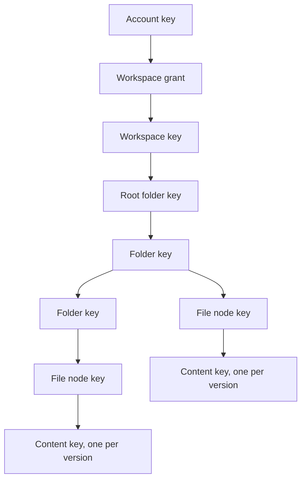

# Drive: tree, content encryption, and transfers

Status: design, not implemented. This document fixes the shape of HushOS Drive before code is written, the way `opaque-auth-design.md` fixed authentication. It builds on what exists: independent workspace keys with per-member grants, `workspace_storage` with `used_bytes` and `reserved_bytes`, storage entitlements written by billing, and a pg-boss worker. Everything below the workspace key is new.

Goals for the first release: upload, download, rename, move, copy, trash and restore of files and folders inside a personal workspace, with content and names unreadable to the operator, quota enforced before bytes move, and transfers that survive a closed tab. Sharing, a version-history UI, search, and previews are later, as are desktop, mobile, file-system and command-line clients; the design leaves room for each and says where.

## Key hierarchy



Every node in the tree, folder or file, has its own random 32-byte **node key**, wrapped under its parent's node key. The root folder's key is wrapped under the workspace key. A file's node key encrypts its metadata and wraps one **content key** per version; the content key encrypts the bytes. Nothing below the workspace key is derived from anything else, so:

- moving a node rewraps one key, and no descendant or ciphertext is touched;
- rotating an account root rewraps one grant per workspace, as today;
- removing a member from a shared folder, later, rotates that folder's key and rewraps its direct children only, because grandchildren are wrapped under keys that did not change.

The client generates every node id, version id and key. The server never sees a key, a name, or a plaintext byte.

## Envelopes and contexts

All envelopes use envelope suite 1 from the authentication design: XChaCha20-Poly1305-IETF from libsodium with a random 24-byte nonce and JSON associated data. UUIDs are lowercase. `epoch` and `version` are positive integers.

```text
nodeKeyEnvelope
  key   = parent node key (root: the workspace key)
  nonce = random(24)
  aad   = ["hushos/drive/node-key", 1, workspaceId, nodeId, parentId, keyEpoch]
  body  = XChaCha20-Poly1305(nodeKey, key, nonce, aad)        // 48 bytes

metadataEnvelope
  key   = node key
  nonce = random(24)
  aad   = ["hushos/drive/node-meta", 1, workspaceId, nodeId, metadataVersion]
  body  = XChaCha20-Poly1305(UTF8(JSON metadata), nodeKey, nonce, aad)

contentKeyEnvelope
  key   = node key
  nonce = random(24)
  aad   = ["hushos/drive/content-key", 1, workspaceId, nodeId, versionId]
  body  = XChaCha20-Poly1305(contentKey, nodeKey, nonce, aad)  // 48 bytes
```

The root folder's node-key envelope uses the workspace id as `parentId` and the workspace key as the wrapping key, with `keyEpoch` equal to the workspace key epoch. `parentId` is bound into the key envelope because a move rewraps anyway; it is left out of the metadata envelope so that a move never re-encrypts metadata and a rename never rewraps a key. The server owns `created_at` and `updated_at`; the client does not put timestamps into metadata to bump them.

Metadata is a JSON object: `{ "name": string, "mime": string | null, "size": number | null, "modified": string | null }`. `size` is the plaintext size and `modified` the source file's mtime, both informational. Names are limited to 255 UTF-8 code points and may not contain `/` or be `.` or `..`; the client enforces this because the server cannot see them. Two siblings may have the same name; the server has no way to prevent it, and the client shows both.

## Content encryption

Content suite 1 encrypts a version as independent chunks rather than a libsodium secretstream, so that an interrupted upload can resume by re-encrypting only the missing chunks, and a download can start at any chunk.

```text
contentKey   = random(32)
contentNonce = random(16)                       // per version, stored in the clear
chunkSize    = 8 MiB of plaintext               // fixed for suite 1
chunkCount   = ceil(plaintextSize / chunkSize)  // 1 for an empty file

chunk i, 0 <= i < chunkCount:
  nonce = contentNonce || u64be(i)              // 24 bytes
  aad   = ["hushos/drive/content", 1, workspaceId, nodeId, versionId,
           i, chunkCount, plaintextSize]
  body  = XChaCha20-Poly1305(plaintextChunk_i, contentKey, nonce, aad)
```

Every ciphertext chunk is exactly `chunkSize + 16` bytes except the last, and the object is the concatenation of chunks in order. This answers each defect the 2026 audit found in the old design:

- The suite and chunk size are recorded on the version row, so a reader never guesses the framing.
- `chunkCount` and `plaintextSize` are in every chunk's associated data, so a truncated or padded object fails authentication rather than decrypting to a shorter file, and the last chunk is identified by index rather than by a trailing marker the transport could drop.
- Chunk boundaries are fixed by arithmetic, so the reader slices the byte stream itself and does not care how the network framed it.
- Part boundaries for multipart upload are the same arithmetic: one part per chunk. 8 MiB clears S3's 5 MiB minimum part size and its 10,000-part ceiling allows objects up to 80 GiB, above the release limit below.

Encryption and decryption run in the existing crypto worker, which already holds libsodium and the unlocked keys; the main thread streams bytes to it and never sees keys. A version's ciphertext size is `plaintextSize + 16 * chunkCount`, and this number, not the plaintext size, is what quota counts.

## Data model

Three new tables. Byte counts are `bigint`; binary is `bytea` with length checks like the auth tables.

```text
drive_nodes
  id                uuid PK           client-generated
  workspace_id      uuid FK workspaces, cascade
  parent_id         uuid FK drive_nodes, null only for the root
  kind              'folder' | 'file'
  path              ltree             labels are node ids without hyphens
  key_epoch         integer >= 1
  key_envelope      bytea             24-byte nonce || 48-byte body
  metadata_version  integer >= 1
  metadata_envelope bytea             24-byte nonce || body
  current_version_id uuid FK file_versions, files only
  trashed_at        timestamptz null
  trash_root_id     uuid null         the node whose trashing covered this one
  change_seq        bigint            per-workspace sequence, set on every change
  purged_at         timestamptz null  tombstone: row kept 90 days after purge
  created_at, updated_at timestamptz

  unique (workspace_id) where parent_id is null       -- exactly one root
  unique (id, workspace_id)                            -- lets parent FK include workspace
  FK (parent_id, workspace_id) -> drive_nodes (id, workspace_id)
  GiST index on path; index on (parent_id) where trashed_at is null
  index on (workspace_id, change_seq)

file_versions
  id              uuid PK           client-generated
  node_id         uuid FK drive_nodes, cascade
  workspace_id    uuid
  object_key      text              "ws/{workspaceId}/{versionId}"
  content_suite   smallint = 1
  chunk_size      integer
  chunk_count     integer >= 1
  content_nonce   bytea(16)
  content_key_envelope bytea        24 || 48
  plaintext_size  bigint >= 0       informational, from the client
  ciphertext_size bigint >= 0       verified against the object on commit
  status          'pending' | 'ready' | 'deleted'
  storage_class   'standard' | 'cold'
  last_read_at    timestamptz null  set when a download URL is issued, at most hourly
  created_at, ready_at, superseded_at, deleted_at timestamptz

drive_uploads
  id              uuid PK
  version_id      uuid FK file_versions
  workspace_id    uuid
  multipart_id    text              the store's upload id
  reserved_bytes  bigint            what was added to reserved_bytes
  expires_at      timestamptz
  status          'open' | 'completed' | 'aborted'
  created_at timestamptz
```

The tree lives only in Postgres; object keys are flat. Files and folders share `drive_nodes` so subtree operations are one statement. A workspace gets its root row when Drive is first opened, created in the same request that stores the root key envelope; existing accounts get it lazily, new accounts at registration once the client generates it.

`workspaces` gains `change_seq bigint`, incremented by every change to any node in it; the changed node takes the new value. A listing can be cached against it, and the change feed below is a range query on it. A purged node keeps its row as a tombstone, envelopes cleared, for 90 days so that a client that was offline learns of the deletion.

## Tree operations

**Listing** returns a folder's live children with their envelopes, plus the chain of ancestors from the root, in one query using `path`. The client unwraps root to current folder, then children in parallel, and caches unwrapped node keys per session in the worker.

**Create folder or file** inserts the node with its key and metadata envelopes; a file is created with its first version in `pending` state as part of the upload flow below.

**Rename** replaces the metadata envelope with `metadata_version + 1`; the server refuses a stale version with 409. Nothing else changes.

Every write carries the state the client last saw: `metadata_version` for renames, the parent and `key_epoch` for moves, and `current_version_id` (or null for a new file) for uploads. A mismatch is a 409 with the current row, never a silent overwrite. A sync client that loses this race creates a conflict copy, a sibling named by the client, rather than retrying on top of someone else's change.

**Move** takes `{ nodeId, parentId, keyEnvelope }` where the envelope is the same node key rewrapped under the destination's key with the new `parentId` in its context. In one transaction with source and destination rows locked, the server:

1. refuses if the node is the root, trashed, or the destination is trashed or in another workspace;
2. refuses if `destination.path <@ node.path`, which is the cycle check;
3. updates `parent_id` and the envelope on the node;
4. rewrites descendant paths in one statement: `SET path = dest.path || subpath(path, nlevel(oldPrefix) - 1) WHERE path <@ oldPrefix`;
5. assigns the node the workspace's next `change_seq`.

Cost is one small AEAD on the client and one indexed update on the server, regardless of subtree size. No object is touched.

**Copy within a workspace** does not download. The client creates a new node with a fresh node key, and rewraps the _same_ content key under it; the server copies the object with the store's server-side copy and inserts a version row pointing at the new key. The two versions share a content key, which is fine inside one workspace; a copy into a share, later, must re-encrypt under a fresh content key because sharing is the operation that widens who can read the key, and copy must not do that silently.

**Trash** sets `trashed_at = now()` and `trash_root_id = nodeId` on the node and every descendant in one statement. Listings exclude trashed rows; the trash view lists nodes whose `trash_root_id` equals their own id. **Restore** clears both columns on the subtree with that `trash_root_id`, and moves the node to the root if its parent is itself trashed. **Purge** deletes the rows and enqueues object deletions; the worker also purges anything trashed for more than 30 days. Trashed bytes count against quota until purged, and the UI says so; this keeps accounting honest and gives people a reason to empty the trash rather than a surprise.

**Versions** are created by every upload to an existing file. The previous version is marked `superseded_at` and kept for 30 days, counting against quota, then purged by the worker; a version-history UI can be added without changing this. Restoring a version is `current_version_id = old` plus a fresh `superseded_at` on the other.

## Upload protocol

Quota is reserved before any byte is accepted, confirmed against the real object on completion, and released on abort or expiry.

1. **Begin.** `POST /api/drive/uploads` with the node (new or existing), its envelopes, the version's `chunkCount`, `plaintextSize`, `contentNonce`, and the content-key envelope. In one transaction the server checks `base + live entitlements - used - reserved >= ciphertextSize`, refuses with 402 if not, adds `ciphertextSize` to `reserved_bytes`, inserts the node if new and the version as `pending`, and inserts the `drive_uploads` row with a 24-hour expiry. It then starts a multipart upload at the store and returns the upload id and presigned PUT URLs for the first batch of parts.
2. **Parts.** The client encrypts chunk `i` in the worker and PUTs it to part `i + 1`, up to four in flight, retrying a part on failure. The store returns an ETag per part; the client records it. `GET /api/drive/uploads/:id/parts?from=` returns more presigned URLs; URLs expire after an hour and can always be reissued.
3. **Resume.** The client keeps an upload journal in IndexedDB: upload id, version id, the file handle where the browser allows it, and the ETags received. After a reload it asks the server which parts the store has, re-encrypts only the missing chunks, and continues. Chunk encryption is deterministic given the key and nonce, so re-encrypted parts are byte-identical.
4. **Complete.** `POST /api/drive/uploads/:id/complete` with the part list. The server completes the multipart upload, then reads the object's size from the store. If it differs from `ciphertextSize`, the server deletes the object and aborts as below. Otherwise, in one transaction: `used_bytes += size`, `reserved_bytes -= size`, the version becomes `ready` and current, the previous version is superseded, the node takes the next `change_seq`. Completion is idempotent: a repeated call for a completed upload returns the same result.
5. **Abort.** `DELETE /api/drive/uploads/:id`, or the worker's hourly `drive.expire-uploads` job for anything past `expires_at`: abort the multipart upload at the store, release `reserved_bytes`, and delete the pending version and, for a new file, its node.

Sizes are trusted only from the store, never from the client. The reservation is what makes concurrent uploads honest: two uploads that would each fit alone but not together see the other's reservation.

A release-one limit of 32 GiB per file keeps the part count far below 10,000 and bounds a single reservation. Empty files are allowed and have one 16-byte chunk.

## Download

`GET /api/drive/versions/:id/url` returns a presigned GET URL valid for an hour, after checking the session and that the version is `ready` and belongs to a workspace the user is a member of. The client fetches with `Range` headers in chunk-aligned windows, decrypts each chunk in the worker as it arrives, and streams to disk with the File System Access API where available, or to a blob for small files. Downloads are never blocked by quota: being over the allowance stops uploads and nothing else, which is what the pricing page and the terms promise.

Presigned URLs mean the person's browser talks to the object store directly, so the store sees their IP address and the bucket hostname appears in their network log. That is the normal trade for not proxying terabytes through the app server. Proxying stays possible later behind the same API without changing the client protocol.

## Quota

```text
allowance = base_quota_bytes + sum(live storage_entitlements)
used      = used_bytes                 // ready versions, current, superseded and trashed
free      = allowance - used - reserved_bytes
```

An upload begins only if `free >= ciphertextSize`. After a plan ends, `allowance` drops and `free` goes negative; uploads refuse, reads work, trash and purge work and reduce `used`. The worker's daily reconcile already keeps entitlements right; a second job, `drive.audit-usage`, recomputes `used_bytes` from `file_versions` for a sample of workspaces each night and logs any drift, so an accounting bug is noticed rather than trusted.

## Object storage

Any S3-compatible store works: the server uses the AWS SDK's S3 client and presigner, which already sit beside the SES client in the dependency tree. Settings:

| Variable                                             | Purpose                                      |
| ---------------------------------------------------- | -------------------------------------------- |
| `STORAGE_ENDPOINT`                                   | S3 endpoint URL                              |
| `STORAGE_REGION`                                     | Region name the endpoint expects             |
| `STORAGE_BUCKET`                                     | One bucket per instance                      |
| `STORAGE_ACCESS_KEY_ID`, `STORAGE_SECRET_ACCESS_KEY` | Credentials scoped to that bucket            |
| `STORAGE_FORCE_PATH_STYLE`                           | `true` for MinIO and most self-hosted stores |

The bucket needs a CORS rule allowing `PUT` and `GET` with `Range` from `APP_ORIGIN` and exposing `ETag`. The Compose stack gains a MinIO service with a bootstrap step that creates the bucket and the CORS rule, so `bun run selfhost:up` works unchanged. For the hosted service, Hetzner Object Storage in Falkenstein keeps content in Germany alongside the servers, supports multipart with 5 GiB parts and 5 TiB objects, and has no per-request egress surprises; Cloudflare R2 is the alternative if egress cost dominates. Both are S3-compatible, so the choice is configuration.

Object keys carry no information: `ws/{workspaceId}/{versionId}`. The store holds ciphertext only, and a listing of the bucket reveals workspace ids, version ids, sizes and timestamps, nothing else.

## API and packages

A new `@hushos/drive` package with the same split as auth and billing: `./server` for the Elysia handlers' logic (tree, uploads, storage client), `./client` for the browser orchestration (listing cache, upload journal, streaming), `./api` for the contract implemented over the shared Treaty client, and `./protocol` for the constants. Content and envelope primitives go into `@hushos/crypto` under a new `drive.ts`, and the crypto session gains requests for node keys, metadata, and chunk encryption so that keys stay in the worker.

Routes under `/api/drive/`: `workspaces/:id/root`, `workspaces/:id/changes`, `nodes/:id/children` (cursor-paginated), `nodes` (create), `nodes/:id/metadata`, `nodes/:id/parent`, `nodes/:id/copy`, `nodes/:id/trash`, `nodes/:id/restore`, `nodes/:id` (purge), `uploads`, `uploads/:id/parts`, `uploads/:id/complete`, `uploads/:id` (abort), `versions/:id/url`. All are session-bound and Origin-checked like billing; bodies carry envelopes as Base64url with tight length limits.

Worker jobs: `drive.expire-uploads` hourly; `drive.purge` daily for trash and superseded versions past 30 days; `drive.delete-objects` as the queue that purge and account deletion push object keys onto; `drive.audit-usage` and `drive.audit-objects` nightly; `drive.tier` nightly; `drive.orphan-sweep` weekly. Account deletion pushes every object key of the workspace before the transaction that removes the rows, so a failure to delete objects can be retried without a database record to find them from.

## Native clients, sync, and file-system providers

Desktop apps on the operating systems' cloud-file frameworks (File Provider on macOS and iOS, Cloud Files on Windows), a FUSE mount on Linux, mobile apps and a CLI are all planned on top of the same store and API. Nothing in them needs a different storage backend: the store holds opaque ciphertext that any client fetches by presigned URL, and every byte of protocol lives in the API and the crypto suite. What they need from this design, and what it provides:

- **A change feed, not re-listing.** `GET /api/drive/workspaces/:id/changes?since=<seq>&limit=` returns nodes with `change_seq` greater than the cursor in order, envelopes included, tombstones included, and the new cursor. A sync engine keeps one cursor per workspace and never walks the tree after the first sync. A cursor older than the tombstone window forces a full listing.
- **Placeholders and on-demand hydration.** File-system providers show files before their bytes are local and fetch content when opened. Chunk-aligned `Range` reads on the presigned URL, with the chunk index authenticated, mean a client can hydrate any 8 MiB of a file independently and cache chunks by `(versionId, index)`.
- **Whole-version writes.** A save from a desktop app is an upload of a new version, with `current_version_id` as the precondition; the framework's own conflict path handles a 409. Small edits to large files re-upload the file in the first release; content-defined chunking and per-chunk deduplication can be added as a later content suite without changing the tree.
- **Offline creation.** Node and version ids are client-generated, so a client can create folders and stage uploads offline and reconcile when back, with 409s resolved as conflict copies.
- **Stable identifiers.** Renames and moves never change a node id or a version's object key, which is what keeps a provider's local database consistent through them.
- **Portable cryptography.** Every Drive primitive is libsodium: XChaCha20-Poly1305 with JSON associated data, random keys and nonces. There is no Web Crypto in the Drive suite, so a Rust or Swift implementation is a direct transcription with test vectors from the web client. The account-layer HKDF stays where it is; a native client reaches the workspace key through the same grant.
- **Sessions for native clients.** The API today is bound to an `HttpOnly` cookie. Native clients need the same session presented as a bearer token; that is an auth-package change (a session issued to a device, sent in a header, revocable from Account settings) and a prerequisite for the first native client, not a Drive change.
- **Pagination.** Children listings and the change feed are cursor-paginated so a folder with a hundred thousand entries is usable from a mount.

FUSE and File Provider both want fast metadata and lazy content; the tree in Postgres with one round trip per folder and the change feed give the first, ranged chunk reads give the second. A CLI is the same client library without a window.

## Operations: lifecycle, tiering, and backups

The store is the only copy of every file, and the ciphertext cannot be regenerated from anything else. That makes the operational rules part of the design rather than a deployment detail.

**Cleanup has two layers.** The worker is the first: `drive.expire-uploads` aborts multipart uploads past their 24-hour expiry, `drive.purge` removes trash and superseded versions past 30 days, and `drive.delete-objects` drains the deletion queue with retries. The bucket's own lifecycle configuration is the second, for the cases where the worker is down or the database and the store disagree: abort incomplete multipart uploads after 3 days, and nothing else. No expiration rule ever deletes a completed object; only the application does, through the queue, because the store cannot know what a row still references.

**Orphans are swept, slowly.** `drive.orphan-sweep` runs weekly, lists a prefix of the bucket, and deletes objects that have no `file_versions` row and are older than 7 days. The age bound protects an upload whose completion is in flight, and protects a database restored from a backup: after a restore, the sweep is paused for the length of the backup window so that objects the restored database no longer knows about are not destroyed before someone decides whether they matter. The inverse check runs too: `drive.audit-objects` samples `ready` versions nightly, confirms the object exists with the recorded size, and marks any miss so the UI can say the file is unavailable rather than failing to decrypt.

**Storage tiers are a cost lever, not a product feature.** Because content is opaque, moving an object between classes changes nothing for the client. `drive.tier` runs nightly and moves versions not read in 90 days to the provider's infrequent-access class where one exists, recording `storage_class`; a read moves it back on the next access. Only classes with immediate retrieval qualify: archive tiers that need a restore request are excluded, since the download path assumes a presigned GET works now. Hetzner has one class today, so this job is a no-op there; on R2 it maps to Infrequent Access and on AWS to Standard-IA. Superseded and trashed versions are the first candidates, since they are rarely read and already scheduled for purge.

**Backups.** Database backups are already an operator duty; Drive adds the bucket. Bucket versioning at the store stays off, because the application already keeps versions and store-level versioning would double the bill for every overwrite that never happens. Instead the bucket is replicated continuously to a second bucket at a different provider or region, using the store's replication where it exists (R2 and AWS) and a scheduled sync from the worker host with rclone where it does not (Hetzner). The replica keeps deleted objects for 30 days beyond the primary, which is the window for undoing a bad purge or a compromised token. The database backup and the bucket replica are independent; consistency between them is the orphan and audit jobs' job, in that order: restore the database, pause the sweep, run the audit to list versions whose objects are missing, then recover those objects from the replica.

**Encryption at the store.** The store sees ciphertext only, but server-side encryption is still turned on at the bucket where offered, so a disk or snapshot leak at the provider is protected by a second key held by the provider, and the replica is encrypted the same way.

**What the operator can see.** A bucket listing shows workspace ids, version ids, sizes and timestamps. Access logs at the store show which client addresses fetched which version ids. Neither reveals names, structure or content, and the self-hosting guide will say so alongside the retention of those logs.

## Client

The Drive page is a folder view with breadcrumbs, an upload button and drop target, a per-transfer progress list that persists across navigation, and the trash. Uploads run in the crypto worker from a `File` handle streamed in 8 MiB reads; the main thread only forwards progress. A closed tab leaves the journal behind, and the next visit offers to resume or discard. All names, sizes and dates render from decrypted metadata; the server's timestamps fill in where metadata has none.

## What the 2023 design taught

The Hushify Drive worked, and its tree idea, per-node keys wrapped by the parent, is kept. Its defects are each answered above, and they are the tests to write first:

| Hushify                                                                                 | Here                                                                                                            |
| --------------------------------------------------------------------------------------- | --------------------------------------------------------------------------------------------------------------- |
| The root folder key was the master key itself.                                          | The root folder key is random and wrapped under the workspace key; the account root wraps only the grant.       |
| Envelopes had no context; a node's bundles could be swapped or replayed.                | Every envelope binds workspace, node, and parent or version into its associated data.                           |
| Moves never updated descendant paths and allowed cycles.                                | One `ltree` statement rewrites the subtree; `dest.path <@ node.path` is refused under row locks.                |
| Metadata updates were unauthenticated by node id.                                       | Every route is session-bound, Origin-checked, and scoped to the caller's workspaces.                            |
| Client-declared sizes were trusted at commit; a size check existed but never ran.       | Reservation on begin, the store's own size on complete, and `used_bytes` written only there.                    |
| Quota was a read-then-write check, so concurrent uploads overshot.                      | `reserved_bytes` is added in the begin transaction and visible to the next check.                               |
| Cancel updated a status and never aborted the multipart upload; parts accrued silently. | Abort and expiry both call the store's abort; the worker sweeps anything past 24 hours.                         |
| Every folder listing minted a 24-hour download URL for every file.                      | A URL is minted per download request, valid for an hour.                                                        |
| 64 KiB secretstream chunks, sequential only: no ranged reads, no resume.                | 8 MiB independently authenticated chunks: ranged reads and resumed uploads by arithmetic.                       |
| Encryption ran on the main thread despite a worker being present.                       | Encryption and keys stay in the crypto worker; the page forwards bytes and progress.                            |
| Trash was a status with no restore or purge; sharing was a boolean flag.                | Trash, restore and purge are specified; sharing is deliberately left out until membership and key epochs exist. |

## Limits and invariants

- A node's key envelope is bound to its parent, so an envelope from another position cannot be substituted; a metadata envelope is bound to its node and version, so old names cannot be replayed.
- The root cannot be moved, renamed away, trashed or purged; a workspace has exactly one.
- No node can be moved into its own subtree, into a trashed folder, or into another workspace, and the check runs with rows locked.
- `used_bytes` changes only in the complete and purge transactions; `reserved_bytes` only in begin, complete, abort and expiry. Neither is ever set from a client-supplied number.
- A version is `ready` only after the store confirmed its size.
- Over-quota blocks upload begin and nothing else.
- Every object key in the store corresponds to a `file_versions` row, or to one that a `drive.delete-objects` job will remove.
- Every write states the version it saw and is refused with 409 if that is stale; `change_seq` is strictly increasing per workspace, and a tombstone outlives its node by 90 days.

## Decisions to confirm

1. **Hosted store**: Hetzner Object Storage in Falkenstein, or Cloudflare R2. The document assumes Hetzner for residency.
2. **Retention**: 30 days for trash and for superseded versions, both counting against quota. Shorter is easy; "forever" needs a different accounting story.
3. **Per-file limit**: 32 GiB.
4. **Downloads by presigned URL** rather than proxied through the app, accepting that the store sees client addresses.
5. **Versions on every upload to an existing file**, with restore but no history UI in the first release.
6. **Backup target**: a second bucket at a different provider, replicated continuously, keeping deletions 30 days longer than the primary. This is a cost you carry from the first paying customer.
