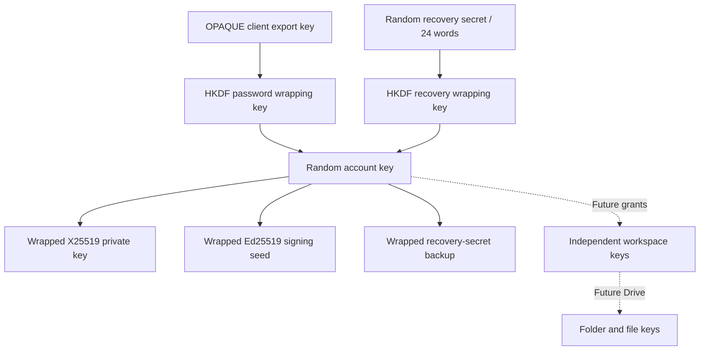

# Authentication, account keys, and recovery

Status: implemented account foundation. Email enrollment, OPAQUE login, remembered browser unlock, recovery-key password reset, stable account identity keys, initial quota provisioning, and permanent account deletion are implemented. Drive encryption, file transfers, sharing, chat, billing checkout, authenticated password change, and cryptographic migrations remain future work.

## Key hierarchy

The **account key** is the user's independent, random 32-byte encryption root. It is not derived from the password. OPAQUE provides a client-only export key used to derive a wrapping key; an independent recovery secret provides another way to wrap the same root. Replacing the password preserves the root and permanent account identity.



Each future workspace key must be independent of the owner's account key, including personal workspaces. Grant a member access to that workspace, never to another person's account root. Workspace keys must be able to outlive their creator's membership. Current workspace records provision ownership and quota, not an encrypted Drive root or member grants.

The stable X25519 and Ed25519 identities prepare for recipient key exchange and signatures. They do not constitute a sharing protocol. Sharing still needs authenticated recipient-key verification, membership and key epochs. Chat additionally needs device identities, prekeys/session establishment, replay protection, and forward-secret session keys. Never use one static account encryption key directly for all chat messages. Removed recipients cannot be made to forget keys or plaintext already obtained.

## Version and encoding rules

`@hushos/crypto` owns the byte-level protocol. HTTP uses canonical unpadded Base64url; PostgreSQL uses `bytea` for our binary fields. Serenity's registration and handshake messages remain the library's opaque text strings. Unknown suites fail closed.

- OPAQUE profile 1: Serenity's Ristretto implementation, explicit Argon2id with 65,536 KiB memory, three iterations, parallelism four, and server identifier `hushos/opaque/profile/1`.
- Envelope suite 1: HKDF-SHA-256 and libsodium XChaCha20-Poly1305-IETF, combined ciphertext followed by its 16-byte tag.
- Account-key version 1: a 32-byte random account key. Credential revisions increment on password reset and are separate from root-key versions.
- Identity suite 1: independently generated `crypto_box_keypair` (X25519) and `crypto_sign_seed_keypair` (Ed25519 from a random 32-byte seed).
- Recovery suite 1: a random 32-byte secret encoded as 24 English BIP39 words. Recovery revisions increment when that secret is replaced.
- Device suite 1: browser Web Crypto AES-256-GCM with a non-exportable device key, 12-byte nonce, and 16-byte tag.

UUIDs in authenticated contexts are lowercase. Contexts use UTF-8 encoding of the exact JSON arrays below, without additional whitespace. Versions are positive JSON integers. The root, recovery secret, nonces, salts, and signing seed come from a cryptographically secure random generator. Libsodium implements asymmetric key-pair generation and AEAD; Web Crypto implements HKDF and the browser device envelope. Argon2id stays inside Serenity's OPAQUE implementation, so the standard `libsodium-wrappers` package suffices.

## Password envelope

```text
accountKey = random(32)
salt = random(32)
nonce = random(24)
wrappingKey = HKDF-SHA-256(
    base64urlDecode(opaqueExportKey), salt,
    UTF8("hushos/account-key/password-wrap/v1"), 32
)
aad = UTF8(JSON.stringify([
    "hushos/account-key/password-wrap", 1,
    lowercase(userId), keyVersion, credentialVersion
]))
encryptedKey = XChaCha20-Poly1305-IETF(accountKey, wrappingKey, nonce, aad)
```

Use the full decoded export key, not its Base64 text or a truncated prefix. The password envelope stores its suite, root version, credential revision, salt (32 bytes), nonce (24 bytes), and ciphertext (48 bytes). Generate new salt and nonce on replacement.

OPAQUE's export key is client-only; its separate session key is shared with the server and must never encrypt the account root or content. Export-key stability applies to repeated logins of the same registration, not fresh registration or a password change. [Serenity interface](https://opaque-auth.com/docs), [HKDF specification](https://datatracker.ietf.org/doc/html/rfc5869#section-3), [XChaCha20-Poly1305](https://doc.libsodium.org/secret-key_cryptography/aead/chacha20-poly1305/xchacha20-poly1305_construction).

## Stable account identity

At signup, create independent X25519 encryption and Ed25519 signing key pairs. Encrypt the X25519 private key (32 bytes) and Ed25519 seed (32 bytes), each producing 48-byte ciphertext. Only public keys and encrypted private material reach the server.

A single fresh identity wrapping salt is 32 bytes; each envelope uses its own random 24-byte nonce. HKDF input is the account root, with distinct `info` strings:

```text
hushos/identity/encryption-private-wrap/v1
hushos/identity/signing-seed-wrap/v1
```

Associated data is:

```text
["hushos/identity", 1, lowercase(userId), 1, purpose, publicKeyBase64url]
```

`purpose` is respectively `encryption-private-wrap` or `signing-seed-wrap`. Public-key binding detects substitution when the client opens the envelope. The encrypted Ed25519 seed reconstructs its full signing key using libsodium. Identity records have no ordinary overwrite endpoint and are unchanged during password recovery. [Libsodium signatures](https://doc.libsodium.org/public-key_cryptography/public-key_signatures).

## Recovery envelopes and authorization

Generate an independent 32-byte recovery secret, convert it to a 24-word English BIP39 phrase, and generate a fresh 32-byte recovery salt. Three HKDF derivations use different purposes:

| Purpose                 | HKDF input      | `info`                              |
| ----------------------- | --------------- | ----------------------------------- |
| Wrap account root       | Recovery secret | `hushos/recovery/account-wrap/v1`   |
| Back up recovery secret | Account root    | `hushos/recovery/secret-backup/v1`  |
| Authorize recovery      | Recovery secret | `hushos/recovery/authentication/v1` |

All use HKDF-SHA-256, the recovery salt, and 32-byte output. The authorization output is an Ed25519 signing seed. Only its public key is stored. It is a dedicated recovery identity and is separate from the stable account signing key.

Both encrypted envelopes use distinct random 24-byte nonces and this associated-data shape:

```text
["hushos/recovery", 1, purpose, lowercase(userId), 1, recoveryVersion]
```

Purpose is `account-wrap` or `secret-backup`. Each ciphertext is 48 bytes. A user who has unlocked the root can decrypt the recovery-secret backup locally to redisplay the phrase. The recovery screen temporarily receives that phrase for display, QR encoding, and a local text download. It never puts the phrase in a URL, API request, persistent app store, or analytics event. The downloadable kit intentionally contains the secret phrase and encrypted recovery envelope and must be kept private.

Password recovery:

1. Request `/recover` email verification. Enrollment purpose is `recover`, distinct from signup. The link alone cannot reset credentials.
2. With a verified enrollment cookie, start fresh OPAQUE registration for the account's existing UUID. The server issues a five-minute, single-use random attempt bound to the enrollment, user, and current credential revision.
3. In the crypto worker, decode the 24-word phrase, derive its recovery signing key, verify its public key matches the stored recovery identity, and decrypt the original root.
4. Finish the new OPAQUE registration and rewrap that same root with the new export key and incremented credential revision. Generate a replacement recovery secret, envelope, and verification key.
5. Sign the canonical reset message below with the **old** recovery signing key. Send the new OPAQUE record, encrypted envelopes, and signature. The new password and recovery phrase never leave the client.
6. The server consumes the attempt before proof verification. It checks the signature and all bindings, then locks the user, rechecks the credential revision and verified enrollment, replaces credentials and envelopes atomically, revokes every session/login/recovery attempt, and consumes recovery enrollments.
7. Complete a fresh OPAQUE login using the new password. Save the replacement recovery phrase.

Canonical signed message:

```text
[
  "hushos/recovery/reset", 1, lowercase(userId), attemptToken, currentCredentialVersion,
  registrationRecord,
  [envelopeVersion, keyVersion, newCredentialVersion, wrappingSalt, wrappingNonce, encryptedKey],
  [recoverySuite, keyVersion, newRecoveryVersion, wrappingSalt, wrappingNonce, encryptedKey,
   backupNonce, encryptedRecoveryKey, recoveryPublicKey]
]
```

The server's signature check binds every replacement field; it does not establish that an arbitrary client constructed its ciphertext correctly. An honest client must verify local recovery and preserve the root. Serenity documents reset as new OPAQUE registration replacing the old record; preserving encrypted content requires this additional envelope/proof protocol. [Password reset guide](https://opaque-auth.com/docs/guides/password-reset).

Replacing a recovery phrase revokes its future server recovery authorization. It **cannot** invalidate an old phrase paired with an old encrypted root envelope: that offline kit still opens the unchanged root. Root rotation and content-key migration would be a different operation. Email alone cannot restore a lost root; loss of password, remembered access, and recovery kit means losing access to the encryption keys.

## Enrollment and session state

Signup progresses through `/register`, `/register/check-email`, `/register/complete`, and `/app/recovery-key`. Plain `/register` renders the email form during SSR; verified fragment processing happens only on the completion page. TanStack Form and local Zod schemas validate form values. The backend independently validates nonsecret fields and wire payloads. It cannot validate a plaintext password it never receives.

Email addresses are trimmed and lowercased for lookup, without provider-specific alias rules. Display names use NFC and 1–100 Unicode code points. These are server-readable metadata, not encryption identifiers. The immutable account UUID is the OPAQUE identifier.

Email enrollment lasts 30 minutes. A random 32-byte verification token is stored only as SHA-256 and sent in a URL fragment; it never enters an HTTP path. Verification atomically consumes it and issues a different random hashed enrollment token in an HttpOnly cookie. Registration inserts the user, credential, password/recovery/identity bundles, personal workspace, and base quota in one transaction, then consumes enrollment. Existing users cannot be reinitialized by signup.

Login attempts last five minutes, use random 32-byte handles stored as hashes, and are consumed even for a bad finish. Unknown emails use OPAQUE decoy records. After OPAQUE verification, the server locks the user, checks the credential revision and matching envelope, and creates a seven-day session with a fresh independent 32-byte token. Only its SHA-256 hash is stored in PostgreSQL. Reauthentication replaces the current browser session. Requests join the session to the current credential revision; revocation takes effect on subsequent requests.

Cookies use HttpOnly, SameSite=Lax, Path=/, no Domain, and Secure plus the `__Host-` prefix under HTTPS. Auth mutations require the exact configured Origin and JSON content type, enforce a streaming 16 KiB body limit before parsing, and use shared PostgreSQL rate limits. Responses use private/no-store and no-referrer. Expired rows are cleaned opportunistically at a bounded rate.

## Remembered browser unlock and portability

The crypto worker owns the plaintext root. Zustand's persisted state contains only a versioned encrypted device bundle and lock revision. A non-exportable AES-GCM device key is stored as a `CryptoKey` in IndexedDB. The root is wrapped inside the worker, never exported to UI state.

Device associated data:

```text
["hushos/device-unlock", 1, lowercase(userId), keyVersion, credentialVersion, deviceKeyId]
```

A reload/new tab reads the encrypted bundle, validates a live server session and matching user/credential revision, loads the device key, then unwraps in its worker. Explicit lock/sign-out clears the encrypted bundle and device keys, terminates the worker, and propagates lock state through storage events and BroadcastChannel. `removeItem` and `clear` storage events count as locks. `pagehide` clears only memory so a later valid session can restore access. Epoch checks prevent a pending restore from reopening a deliberately locked worker. Protected pages also recheck sessions on focus and periodically.

Non-exportability prevents ordinary raw-key export; it does not stop malicious same-origin code from using the key. XSS, a compromised client build, browser profile compromise, and hostile device software remain distinct threats. JavaScript cannot guarantee zeroization of strings or garbage-collector copies.

`createCryptoSession` has no React, fetch, IndexedDB, or Worker dependency. `CryptoTransport` is the coordinator boundary, with a browser Worker implementation. `DeviceKeyStore` contains the browser Web Crypto persistence adapter. Electron can use this secure renderer arrangement with its normal isolation/CSP requirements. React Native needs a JSI/native crypto and secure-storage adapter; Rust/Swift implementations must reproduce the exact suites, OPAQUE profile, Base64url encoding, and associated-data bytes. They should keep private material in their native vault and use OS-protected device wrapping. Those native integrations are not implemented by this web scaffold.

## Quota and permanent deletion

New accounts receive a personal workspace and a configurable base allowance (default 1 GiB). `workspace_storage` uses bigint for base quota, used bytes, and reserved bytes. `storage_entitlements` holds separate positive grants with unique source references and optional expiry/revocation. APIs return byte counts as decimal strings. There is no public quota mutation, checkout, or billing webhook.

Future uploads must reserve ciphertext bytes transactionally before presigning, reconcile actual object sizes, and count retained versions/trash. Quota records alone do not enforce a file-transfer protocol.

Deletion requires a current session plus a fresh OPAQUE password exchange explicitly tagged `delete` and bound to that session hash. Ordinary login attempts cannot authorize deletion. The delete transaction rechecks session/revision and removes the personal workspace, storage records, account, all key bundles, and all sessions. Client cookies and remembered access are cleared. There are no Drive objects yet; object cleanup and billing cancellation must join the deletion workflow when those features exist. Backups and provider email retention remain operator policies.

## Logs and trust limits

Nitro/evlog owns request completion events. Auth code adds only allowlisted action/outcome fields. Runtime redaction excludes arbitrary auth context and raw errors before console output and drains; development uses the same policy as production. No passwords, recovery phrases, raw/private keys, OPAQUE messages, session/verification tokens, request bodies, or cookies belong in logs. Correlation IDs are server-generated. Client crypto code has no logger.

The operator can see email, name, account/workspace IDs, quotas, timestamps, public keys, encrypted bundles, and access patterns. This is not an anonymous-account design. E2EE cannot protect against a malicious server that delivers hostile client code. Associated-data binding detects cross-context substitutions; it does not prevent rollback of an entire consistent server database snapshot. Version fields identify suites and revisions; safe migrations and independent cryptographic review remain separate work.

## Packages and migrations

- `@hushos/crypto`: OPAQUE profile, key derivation/envelopes, identity/recovery, device envelope, portable crypto session.
- `@hushos/auth`: HTTP-independent server services, cookies, auth coordination, worker transport and browser device storage.
- `@hushos/db`: typed schema/relations and transactional repositories; migrations are generated with Drizzle Kit.
- `@hushos/env`: T3 Env/Zod server-only configuration validation.
- `@hushos/emails`: React Email templates and SMTP/Resend/SES adapters.
- `@hushos/logging`: evlog integration and redaction policy.

`OPAQUE_SERVER_SETUP` must persist and be backed up with the database. Never regenerate it at startup. Suite/profile migrations require explicit client support, authentication, local rewrapping, revision checks, and transactional replacement; never relabel old ciphertext or records. Development accounts made before recovery/identity/quota provisioning finish that setup after their next unlock. The worker creates only missing private-key bundles under the existing account key. The authenticated setup transaction rechecks the live session and credential revision, locks the user, and inserts missing records without overwriting established keys. Database migrations never fabricate private keys.
